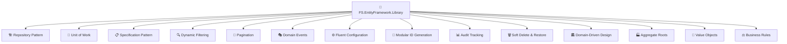
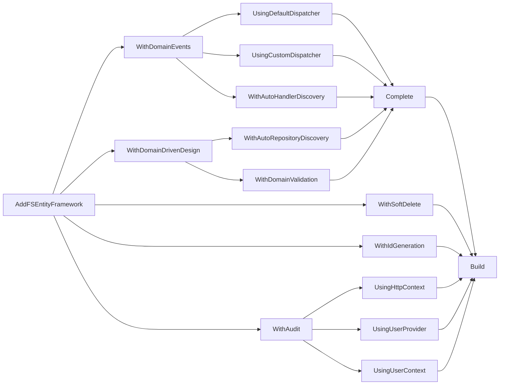
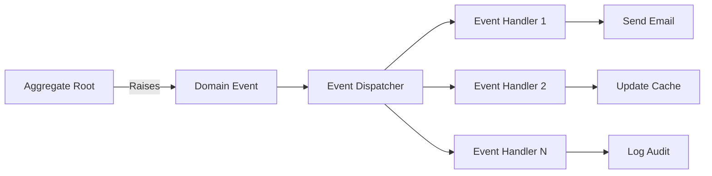
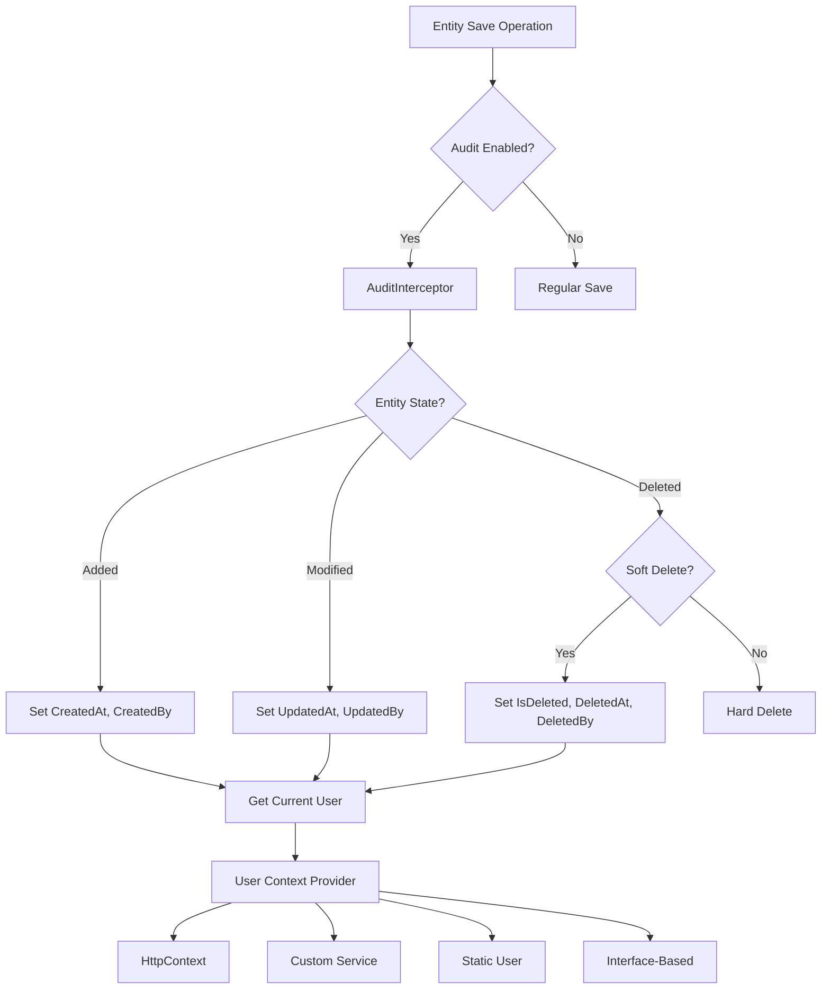
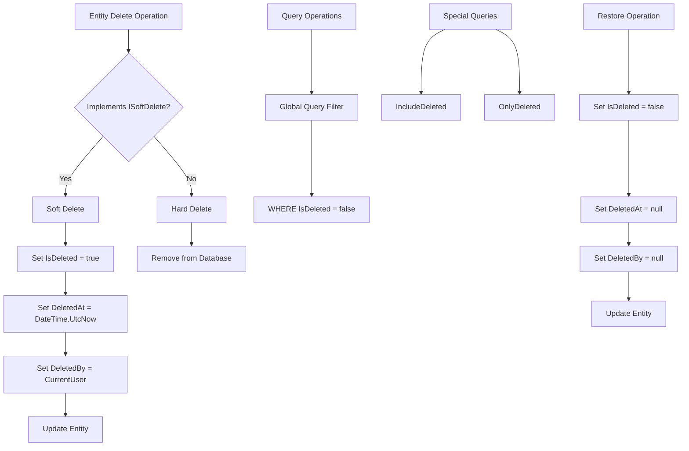
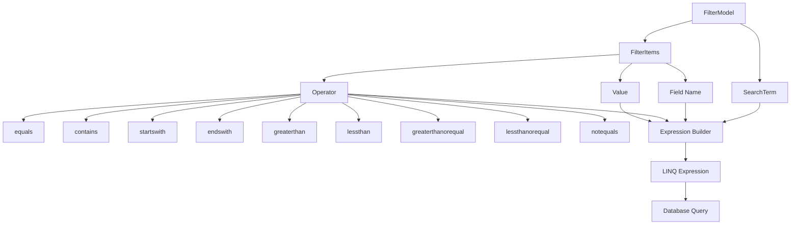

# FS.EntityFramework.Library

[](https://www.nuget.org/packages/FS.EntityFramework.Library/)
[](https://www.nuget.org/packages/FS.EntityFramework.Library/)
[](https://github.com/furkansarikaya/FS.EntityFramework.Library/blob/main/LICENSE)
[](https://github.com/furkansarikaya/FS.EntityFramework.Library/stargazers)

A comprehensive, production-ready Entity Framework Core library providing **Repository pattern**, **Unit of Work**, **Specification pattern**, **dynamic filtering**, **pagination support**, **Domain Events**, **Domain-Driven Design (DDD)**, **Fluent Configuration API**, and **modular ID generation** strategies for .NET applications.

## 🌟 Why Choose FS.EntityFramework.Library?



## 📋 Table of Contents

- [🚀 Quick Start](#-quick-start)
- [💾 Installation](#-installation)
- [⚙️ Configuration](#️-configuration)
  - [🆕 Fluent Configuration API (Recommended)](#-fluent-configuration-api-recommended)
  - [🔧 Classic Configuration](#-classic-configuration)
- [🏗️ Core Concepts](#️-core-concepts)
  - [📦 Base Entities](#-base-entities)
  - [🏛️ Repository Pattern](#️-repository-pattern)
  - [🔄 Unit of Work Pattern](#-unit-of-work-pattern)
  - [📋 Specification Pattern](#-specification-pattern)
- [🏛️ Domain-Driven Design (DDD)](#️-domain-driven-design-ddd)
  - [🏭 Aggregate Roots](#-aggregate-roots)
  - [📐 Value Objects](#-value-objects)
  - [⚖️ Business Rules & Domain Guard](#️-business-rules--domain-guard)
  - [🎯 Domain Specifications](#-domain-specifications)
  - [🏗️ Domain Repositories](#️-domain-repositories)
  - [🔄 Domain Unit of Work](#-domain-unit-of-work)
- [🎭 Domain Events](#-domain-events)
- [📊 Audit Tracking](#-audit-tracking)
- [🗑️ Soft Delete & Restore](#️-soft-delete--restore)
- [🔍 Dynamic Filtering](#-dynamic-filtering)
- [📄 Pagination](#-pagination)
- [🔑 ID Generation](#-id-generation)
- [📚 Advanced Usage](#-advanced-usage)
- [🎯 Best Practices](#-best-practices)
- [🔧 Troubleshooting](#-troubleshooting)
- [📖 API Reference](#-api-reference)
- [🤝 Contributing](#-contributing)

## 🚀 Quick Start

### 1️⃣ Basic Setup (30 seconds)

```csharp
// 1. Install NuGet package
dotnet add package FS.EntityFramework.Library

// 2. Configure your DbContext
services.AddDbContext<YourDbContext>(options =>
    options.UseSqlServer(connectionString));

// 3. Add FS.EntityFramework (One line setup!)
services.AddFSEntityFramework<YourDbContext>()
    .Build();

// 4. Create your entities
public class Product : BaseAuditableEntity<int>
{
    public string Name { get; set; } = string.Empty;
    public decimal Price { get; set; }
}

// 5. Use in your services
public class ProductService
{
    private readonly IUnitOfWork _unitOfWork;
    
    public ProductService(IUnitOfWork unitOfWork)
    {
        _unitOfWork = unitOfWork;
    }
    
    public async Task<Product> CreateProductAsync(string name, decimal price)
    {
        var repository = _unitOfWork.GetRepository<Product, int>();
        var product = new Product { Name = name, Price = price };
        
        await repository.AddAsync(product);
        await _unitOfWork.SaveChangesAsync();
        
        return product;
    }
}
```

### 2️⃣ Full-Featured Setup (Production Ready with DDD)

```csharp
services.AddFSEntityFramework<YourDbContext>()
    .WithAudit()                          // 📊 Automatic audit tracking
        .UsingHttpContext()               // 👤 User tracking via HTTP context
    .WithDomainEvents()                   // 🎭 Domain events support
        .UsingDefaultDispatcher()         // 📡 Default event dispatcher
        .WithAutoHandlerDiscovery()       // 🔍 Auto-discover event handlers
    .Complete()                           // ✅ Complete domain events setup
    .WithSoftDelete()                     // 🗑️ Soft delete functionality
    .WithDomainDrivenDesign()             // 🏛️ DDD support
        .WithAutoRepositoryDiscovery()    // 🏗️ Auto-discover domain repositories
        .WithDomainValidation()           // ⚖️ Domain validation services
    .Complete()                           // ✅ Complete DDD setup
    .WithGuidV7()                         // 🔑 GUID V7 ID generation
    .ValidateConfiguration()              // ✅ Validate setup
    .Build();
```

## 💾 Installation

### Core Package

```bash
# Core library with all essential features including DDD
dotnet add package FS.EntityFramework.Library
```

### Extension Packages (Optional)

```bash
# GUID Version 7 ID generation (.NET 9+)
dotnet add package FS.EntityFramework.Library.GuidV7

# ULID ID generation
dotnet add package FS.EntityFramework.Library.UlidGenerator
```

### Requirements

- **.NET 9.0** or later
- **Entity Framework Core 9.0.7** or later
- **Microsoft.AspNetCore.Http.Abstractions 2.3.0** or later (for HttpContext support)

## ⚙️ Configuration

### 🆕 Fluent Configuration API (Recommended)

The Fluent Configuration API provides an intuitive, chainable way to configure the library with better readability and validation.



#### Basic Configuration Options

```csharp
// 🔧 Minimal setup
services.AddFSEntityFramework<YourDbContext>()
    .Build();

// 📊 With audit tracking
services.AddFSEntityFramework<YourDbContext>()
    .WithAudit()
        .UsingHttpContext()
    .Build();

// 🎭 With domain events
services.AddFSEntityFramework<YourDbContext>()
    .WithDomainEvents()
        .UsingDefaultDispatcher()
        .WithAutoHandlerDiscovery()
    .Complete()
    .Build();

// 🗑️ With soft delete
services.AddFSEntityFramework<YourDbContext>()
    .WithSoftDelete()
    .Build();

// 🏛️ With Domain-Driven Design
services.AddFSEntityFramework<YourDbContext>()
    .WithDomainDrivenDesign()
        .WithAutoRepositoryDiscovery()
        .WithDomainValidation()
    .Complete()
    .Build();
```

#### Advanced DDD Configuration

```csharp
services.AddFSEntityFramework<YourDbContext>()
    // 📊 Audit Configuration
    .WithAudit()
        .UsingUserProvider(provider => 
        {
            var userService = provider.GetService<ICurrentUserService>();
            return userService?.GetCurrentUserId();
        })
    
    // 🎭 Domain Events Configuration
    .WithDomainEvents()
        .UsingDefaultDispatcher()
        .WithAutoHandlerDiscovery(typeof(ProductCreatedEvent).Assembly)
        .WithAttributeBasedDiscovery(Assembly.GetExecutingAssembly())
        .WithHandler<ProductCreatedEvent, ProductCreatedEventHandler>()
    .Complete()
    
    // 🏛️ Domain-Driven Design Configuration
    .WithDomainDrivenDesign()
        .WithAutoRepositoryDiscovery(Assembly.GetExecutingAssembly())
        .WithRepository<ProductAggregate, Guid>()
        .WithCustomRepository<OrderAggregate, Guid, OrderRepository>()
        .WithDomainValidation()
    .Complete()
    
    // 🗑️ Soft Delete Configuration
    .WithSoftDelete()
    
    // 🔑 ID Generation Configuration
    .WithIdGeneration()
        .WithGenerator<Guid, MyCustomGuidGenerator>()
    .Complete()
    
    // 🎯 Custom Repository Registration
    .WithCustomRepository<Product, int, ProductRepository>()
    .WithRepositoriesFromAssembly(Assembly.GetExecutingAssembly())
    
    // ⚙️ Additional Services
    .WithServices(services =>
    {
        services.AddScoped<IMyCustomService, MyCustomService>();
    })
    
    // 🔍 Conditional Configuration
    .When(isDevelopment, builder =>
        builder.WithDetailedLogging(enableSensitiveDataLogging: true))
    
    // ✅ Validation & Build
    .ValidateConfiguration()
    .Build();
```

### 🔧 Classic Configuration

The original configuration methods are still supported for backward compatibility:

```csharp
// Basic setup without audit
services.AddGenericUnitOfWork<YourDbContext>();

// With audit support using user service
services.AddGenericUnitOfWorkWithAudit<YourDbContext>(
    provider => provider.GetRequiredService<ICurrentUserService>().UserId);

// With Domain-Driven Design services
services.AddDomainServices();
services.AddDomainRepositoriesFromCallingAssembly();

// With domain events
services.AddDomainEvents();
services.AddDomainEventHandlersFromAssembly(typeof(ProductCreatedEvent).Assembly);
```

## 🏗️ Core Concepts

### 📦 Base Entities

The library provides several base entity classes to build your domain models:

```csharp
// 1️⃣ Basic Entity (ID + Domain Events)
public class Tag : BaseEntity<int>
{
    public string Name { get; set; } = string.Empty;
    public string Color { get; set; } = "#000000";
}

// 2️⃣ Auditable Entity (ID + Audit Properties + Domain Events)
public class Category : BaseAuditableEntity<int>
{
    public string Name { get; set; } = string.Empty;
    public string Description { get; set; } = string.Empty;
    
    // Automatic properties:
    // - CreatedAt, CreatedBy
    // - UpdatedAt, UpdatedBy
}

// 3️⃣ Full-Featured Entity (ID + Audit + Soft Delete + Domain Events)
public class Product : BaseAuditableEntity<int>, ISoftDelete
{
    public string Name { get; set; } = string.Empty;
    public decimal Price { get; set; }
    public string Description { get; set; } = string.Empty;
    public int CategoryId { get; set; }
    
    // Navigation property
    public Category Category { get; set; } = null!;
    
    // ISoftDelete properties (automatic)
    public bool IsDeleted { get; set; }
    public DateTime? DeletedAt { get; set; }
    public string? DeletedBy { get; set; }
    
    // Factory method with domain events
    public static Product Create(string name, decimal price, string description, int categoryId)
    {
        var product = new Product
        {
            Name = name,
            Price = price,
            Description = description,
            CategoryId = categoryId
        };
        
        // Raise domain event
        product.AddDomainEvent(new ProductCreatedEvent(product.Id, name, price));
        
        return product;
    }
    
    public void UpdatePrice(decimal newPrice)
    {
        var oldPrice = Price;
        Price = newPrice;
        
        // Raise domain event
        AddDomainEvent(new ProductPriceChangedEvent(Id, oldPrice, newPrice));
    }
}
```

## 🏛️ Domain-Driven Design (DDD)

This library provides comprehensive support for Domain-Driven Design patterns and practices, enabling you to build rich domain models with proper encapsulation and business logic.

### 🏭 Aggregate Roots

Aggregate Roots are the entry points to your aggregates and ensure consistency boundaries:

```csharp
// ✅ Product Aggregate Root
public class ProductAggregate : AggregateRoot<Guid>
{
    private readonly List<ProductVariant> _variants = new();
    
    public string Name { get; private set; } = string.Empty;
    public Money Price { get; private set; } = Money.Zero;
    public ProductStatus Status { get; private set; } = ProductStatus.Draft;
    
    // Read-only access to variants
    public IReadOnlyCollection<ProductVariant> Variants => _variants.AsReadOnly();
    
    // Factory method enforcing business rules
    public static ProductAggregate Create(string name, Money price)
    {
        DomainGuard.AgainstNullOrWhiteSpace(name, nameof(name));
        DomainGuard.AgainstNegativeOrZero(price.Amount, nameof(price));
        
        var product = new ProductAggregate(Guid.CreateVersion7())
        {
            Name = name,
            Price = price,
            Status = ProductStatus.Draft
        };
        
        // Raise domain event
        product.RaiseDomainEvent(new ProductCreatedEvent(product.Id, name, price.Amount));
        
        return product;
    }
    
    // Business method with domain logic
    public void PublishProduct()
    {
        CheckRule(new ProductMustHaveVariantsRule(_variants));
        CheckRule(new ProductMustHaveValidPriceRule(Price));
        
        Status = ProductStatus.Published;
        IncrementVersion();
        
        RaiseDomainEvent(new ProductPublishedEvent(Id, Name));
    }
    
    public void AddVariant(string variantName, Money additionalPrice)
    {
        DomainGuard.AgainstNullOrWhiteSpace(variantName, nameof(variantName));
        
        var variant = new ProductVariant(variantName, additionalPrice);
        _variants.Add(variant);
        
        RaiseDomainEvent(new ProductVariantAddedEvent(Id, variant.Id, variantName));
    }
}

// ✅ Order Aggregate Root with complex business logic
public class OrderAggregate : AggregateRoot<Guid>
{
    private readonly List<OrderItem> _items = new();
    
    public CustomerId CustomerId { get; private set; }
    public OrderStatus Status { get; private set; }
    public Money TotalAmount { get; private set; }
    public DateTime OrderDate { get; private set; }
    
    public IReadOnlyCollection<OrderItem> Items => _items.AsReadOnly();
    
    public static OrderAggregate Create(CustomerId customerId)
    {
        var order = new OrderAggregate(Guid.CreateVersion7())
        {
            CustomerId = customerId,
            Status = OrderStatus.Pending,
            TotalAmount = Money.Zero,
            OrderDate = DateTime.UtcNow
        };
        
        order.RaiseDomainEvent(new OrderCreatedEvent(order.Id, customerId));
        
        return order;
    }
    
    public void AddItem(ProductId productId, Quantity quantity, Money unitPrice)
    {
        CheckRule(new OrderMustBeInPendingStatusRule(Status));
        
        var existingItem = _items.FirstOrDefault(i => i.ProductId == productId);
        if (existingItem != null)
        {
            existingItem.UpdateQuantity(existingItem.Quantity + quantity);
        }
        else
        {
            var item = new OrderItem(productId, quantity, unitPrice);
            _items.Add(item);
        }
        
        RecalculateTotal();
        RaiseDomainEvent(new OrderItemAddedEvent(Id, productId, quantity));
    }
    
    public void ConfirmOrder()
    {
        CheckRule(new OrderMustHaveItemsRule(_items));
        CheckRule(new OrderTotalMustBePositiveRule(TotalAmount));
        
        Status = OrderStatus.Confirmed;
        IncrementVersion();
        
        RaiseDomainEvent(new OrderConfirmedEvent(Id, TotalAmount.Amount));
    }
    
    private void RecalculateTotal()
    {
        TotalAmount = Money.FromDecimal(_items.Sum(i => i.TotalPrice.Amount));
    }
}
```

### 📐 Value Objects

Value Objects encapsulate business concepts and ensure type safety:

```csharp
// ✅ Money Value Object
public class Money : ValueObject
{
    public decimal Amount { get; }
    public string Currency { get; }
    
    public Money(decimal amount, string currency = "USD")
    {
        DomainGuard.AgainstNegative(amount, nameof(amount));
        DomainGuard.AgainstNullOrWhiteSpace(currency, nameof(currency));
        
        Amount = amount;
        Currency = currency;
    }
    
    public static Money Zero => new(0);
    public static Money FromDecimal(decimal amount) => new(amount);
    
    // Value object operations
    public Money Add(Money other)
    {
        if (Currency != other.Currency)
            throw new DomainInvariantViolationException("Cannot add money with different currencies");
        
        return new Money(Amount + other.Amount, Currency);
    }
    
    public Money Multiply(decimal factor) => new(Amount * factor, Currency);
    
    protected override IEnumerable<object> GetEqualityComponents()
    {
        yield return Amount;
        yield return Currency;
    }
    
    // Operators
    public static Money operator +(Money left, Money right) => left.Add(right);
    public static Money operator *(Money money, decimal factor) => money.Multiply(factor);
}

// ✅ Strongly Typed IDs
public class CustomerId : ValueObject
{
    public Guid Value { get; }
    
    public CustomerId(Guid value)
    {
        DomainGuard.Against(value == Guid.Empty, "Customer ID cannot be empty");
        Value = value;
    }
    
    public static implicit operator Guid(CustomerId customerId) => customerId.Value;
    public static implicit operator CustomerId(Guid value) => new(value);
    
    protected override IEnumerable<object> GetEqualityComponents()
    {
        yield return Value;
    }
}

// ✅ Address Value Object
public class Address : ValueObject
{
    public string Street { get; }
    public string City { get; }
    public string PostalCode { get; }
    public string Country { get; }
    
    public Address(string street, string city, string postalCode, string country)
    {
        DomainGuard.AgainstNullOrWhiteSpace(street, nameof(street));
        DomainGuard.AgainstNullOrWhiteSpace(city, nameof(city));
        DomainGuard.AgainstNullOrWhiteSpace(postalCode, nameof(postalCode));
        DomainGuard.AgainstNullOrWhiteSpace(country, nameof(country));
        
        Street = street;
        City = city;
        PostalCode = postalCode;
        Country = country;
    }
    
    protected override IEnumerable<object> GetEqualityComponents()
    {
        yield return Street;
        yield return City;
        yield return PostalCode;
        yield return Country;
    }
}
```

### ⚖️ Business Rules & Domain Guard

Implement business rules and domain validation:

```csharp
// ✅ Business Rules
public class ProductMustHaveVariantsRule : BusinessRule
{
    private readonly IReadOnlyCollection<ProductVariant> _variants;
    
    public ProductMustHaveVariantsRule(IReadOnlyCollection<ProductVariant> variants)
    {
        _variants = variants;
    }
    
    public override bool IsBroken() => _variants.Count == 0;
    
    public override string Message => "Product must have at least one variant to be published";
    
    public override string ErrorCode => "PRODUCT_NO_VARIANTS";
}

public class OrderMustHaveItemsRule : BusinessRule
{
    private readonly IReadOnlyCollection<OrderItem> _items;
    
    public OrderMustHaveItemsRule(IReadOnlyCollection<OrderItem> items)
    {
        _items = items;
    }
    
    public override bool IsBroken() => _items.Count == 0;
    
    public override string Message => "Order must have at least one item";
    
    public override string ErrorCode => "ORDER_NO_ITEMS";
}

// ✅ Using Domain Guard
public class Customer : AggregateRoot<CustomerId>
{
    public string Name { get; private set; } = string.Empty;
    public Email Email { get; private set; } = null!;
    public Address Address { get; private set; } = null!;
    
    public static Customer Create(string name, string email, Address address)
    {
        // Domain Guard validations
        DomainGuard.AgainstNullOrWhiteSpace(name, nameof(name));
        DomainGuard.AgainstNull(address, nameof(address));
        
        var customer = new Customer(new CustomerId(Guid.CreateVersion7()))
        {
            Name = name,
            Email = Email.Create(email),
            Address = address
        };
        
        customer.RaiseDomainEvent(new CustomerCreatedEvent(customer.Id, name, email));
        
        return customer;
    }
    
    public void UpdateAddress(Address newAddress)
    {
        DomainGuard.AgainstNull(newAddress, nameof(newAddress));
        
        var oldAddress = Address;
        Address = newAddress;
        
        RaiseDomainEvent(new CustomerAddressChangedEvent(Id, oldAddress, newAddress));
    }
}
```

### 🎯 Domain Specifications

Build reusable domain logic with specifications:

```csharp
// ✅ Domain Specifications
public class ActiveCustomersSpecification : DomainSpecification<Customer>
{
    public override bool IsSatisfiedBy(Customer candidate)
    {
        return candidate.IsActive && !candidate.IsDeleted;
    }
    
    public override Expression<Func<Customer, bool>> ToExpression()
    {
        return customer => customer.IsActive && !customer.IsDeleted;
    }
}

public class HighValueCustomersSpecification : DomainSpecification<Customer>
{
    private readonly decimal _minimumOrderValue;
    
    public HighValueCustomersSpecification(decimal minimumOrderValue)
    {
        _minimumOrderValue = minimumOrderValue;
    }
    
    public override bool IsSatisfiedBy(Customer candidate)
    {
        return candidate.TotalOrderValue >= _minimumOrderValue;
    }
    
    public override Expression<Func<Customer, bool>> ToExpression()
    {
        return customer => customer.TotalOrderValue >= _minimumOrderValue;
    }
}

// ✅ Using Composite Specifications
public class CustomerQueryService
{
    private readonly IDomainRepository<Customer, CustomerId> _customerRepository;
    
    public CustomerQueryService(IDomainRepository<Customer, CustomerId> customerRepository)
    {
        _customerRepository = customerRepository;
    }
    
    public async Task<IEnumerable<Customer>> GetActiveHighValueCustomersAsync(decimal minimumValue)
    {
        var activeSpec = new ActiveCustomersSpecification();
        var highValueSpec = new HighValueCustomersSpecification(minimumValue);
        
        // Combine specifications
        var combinedSpec = activeSpec.And(highValueSpec);
        
        return await _customerRepository.FindAsync(combinedSpec);
    }
}
```

### 🏗️ Domain Repositories

Domain repositories provide aggregate-specific operations:

```csharp
// ✅ Domain Repository Interface
public interface IProductRepository : IDomainRepository<ProductAggregate, Guid>
{
    Task<IEnumerable<ProductAggregate>> GetByStatusAsync(ProductStatus status, CancellationToken cancellationToken = default);
    Task<ProductAggregate?> GetByNameAsync(string name, CancellationToken cancellationToken = default);
    Task<bool> ExistsWithNameAsync(string name, CancellationToken cancellationToken = default);
}

// ✅ Domain Repository Implementation
public class ProductRepository : DomainRepository<ProductAggregate, Guid>, IProductRepository
{
    public ProductRepository(IRepository<ProductAggregate, Guid> efRepository) 
        : base(efRepository)
    {
    }
    
    public async Task<IEnumerable<ProductAggregate>> GetByStatusAsync(ProductStatus status, CancellationToken cancellationToken = default)
    {
        var specification = new ProductsByStatusSpecification(status);
        return await FindAsync(specification, cancellationToken);
    }
    
    public async Task<ProductAggregate?> GetByNameAsync(string name, CancellationToken cancellationToken = default)
    {
        var specification = new ProductByNameSpecification(name);
        var products = await FindAsync(specification, cancellationToken);
        return products.FirstOrDefault();
    }
    
    public async Task<bool> ExistsWithNameAsync(string name, CancellationToken cancellationToken = default)
    {
        var specification = new ProductByNameSpecification(name);
        return await AnyAsync(specification, cancellationToken);
    }
}

// ✅ Registration
services.AddFSEntityFramework<YourDbContext>()
    .WithDomainDrivenDesign()
        .WithCustomRepository<ProductAggregate, Guid, ProductRepository>()
    .Complete()
    .Build();
```

### 🔄 Domain Unit of Work

Coordinate multiple aggregate changes:

```csharp
// ✅ Domain Service using Domain Unit of Work
public class OrderProcessingService
{
    private readonly IDomainUnitOfWork _domainUnitOfWork;
    private readonly IDomainRepository<OrderAggregate, Guid> _orderRepository;
    private readonly IDomainRepository<ProductAggregate, Guid> _productRepository;
    private readonly IDomainRepository<Customer, CustomerId> _customerRepository;
    
    public OrderProcessingService(
        IDomainUnitOfWork domainUnitOfWork,
        IDomainRepository<OrderAggregate, Guid> orderRepository,
        IDomainRepository<ProductAggregate, Guid> productRepository,
        IDomainRepository<Customer, CustomerId> customerRepository)
    {
        _domainUnitOfWork = domainUnitOfWork;
        _orderRepository = orderRepository;
        _productRepository = productRepository;
        _customerRepository = customerRepository;
    }
    
    public async Task<OrderAggregate> ProcessOrderAsync(ProcessOrderCommand command)
    {
        // Begin domain transaction
        await _domainUnitOfWork.BeginTransactionAsync();
        
        try
        {
            // Load aggregates
            var customer = await _customerRepository.GetByIdRequiredAsync(command.CustomerId);
            var order = OrderAggregate.Create(command.CustomerId);
            
            // Process order items
            foreach (var item in command.Items)
            {
                var product = await _productRepository.GetByIdRequiredAsync(item.ProductId);
                
                // Domain logic - check business rules
                DomainGuard.Against(!product.IsAvailable, "Product is not available");
                
                order.AddItem(item.ProductId, item.Quantity, product.Price);
            }
            
            // Apply customer discount if applicable
            if (customer.IsPremium)
            {
                order.ApplyDiscount(customer.DiscountPercentage);
            }
            
            // Confirm the order
            order.ConfirmOrder();
            
            // Register aggregates for domain event publishing
            _domainUnitOfWork.RegisterAggregate(order);
            _domainUnitOfWork.RegisterAggregate(customer);
            
            // Save aggregate
            await _orderRepository.AddAsync(order);
            
            // Save changes and publish domain events
            await _domainUnitOfWork.SaveChangesAsync();
            
            // Commit transaction
            await _domainUnitOfWork.CommitTransactionAsync();
            
            return order;
        }
        catch
        {
            await _domainUnitOfWork.RollbackTransactionAsync();
            throw;
        }
    }
}
```

## 🎭 Domain Events

Domain Events enable loose coupling and implementing cross-cutting concerns in a clean way.



### Domain Event Implementation

```csharp
// ✅ 1. Define Domain Events
public class ProductCreatedEvent : DomainEvent
{
    public ProductCreatedEvent(Guid productId, string productName, decimal price)
    {
        ProductId = productId;
        ProductName = productName;
        Price = price;
    }
    
    public Guid ProductId { get; }
    public string ProductName { get; }
    public decimal Price { get; }
}

public class OrderConfirmedEvent : DomainEvent
{
    public OrderConfirmedEvent(Guid orderId, decimal totalAmount, CustomerId customerId)
    {
        OrderId = orderId;
        TotalAmount = totalAmount;
        CustomerId = customerId;
    }
    
    public Guid OrderId { get; }
    public decimal TotalAmount { get; }
    public CustomerId CustomerId { get; }
}

// ✅ 2. Create Event Handlers
public class ProductCreatedEventHandler : IDomainEventHandler<ProductCreatedEvent>
{
    private readonly ILogger<ProductCreatedEventHandler> _logger;
    private readonly IEmailService _emailService;
    private readonly ICacheService _cacheService;
    
    public ProductCreatedEventHandler(
        ILogger<ProductCreatedEventHandler> logger,
        IEmailService emailService,
        ICacheService cacheService)
    {
        _logger = logger;
        _emailService = emailService;
        _cacheService = cacheService;
    }
    
    public async Task Handle(ProductCreatedEvent domainEvent, CancellationToken cancellationToken = default)
    {
        _logger.LogInformation("Product created: {ProductName} with price: {Price}", 
            domainEvent.ProductName, domainEvent.Price);
        
        // Invalidate cache
        await _cacheService.InvalidateAsync("products", cancellationToken);
        
        // Send notification email
        await _emailService.SendProductCreatedNotificationAsync(
            domainEvent.ProductName, 
            domainEvent.Price, 
            cancellationToken);
    }
}

// ✅ 3. Order Confirmed Handler
[DomainEventHandler(ServiceLifetime = ServiceLifetime.Scoped, Order = 1)]
public class OrderConfirmedEventHandler : IDomainEventHandler<OrderConfirmedEvent>
{
    private readonly IEmailService _emailService;
    private readonly IInventoryService _inventoryService;
    private readonly IDomainRepository<Customer, CustomerId> _customerRepository;
    
    public OrderConfirmedEventHandler(
        IEmailService emailService,
        IInventoryService inventoryService,
        IDomainRepository<Customer, CustomerId> customerRepository)
    {
        _emailService = emailService;
        _inventoryService = inventoryService;
        _customerRepository = customerRepository;
    }
    
    public async Task Handle(OrderConfirmedEvent domainEvent, CancellationToken cancellationToken = default)
    {
        // Update customer statistics
        var customer = await _customerRepository.GetByIdRequiredAsync(domainEvent.CustomerId, cancellationToken);
        customer.UpdateOrderStatistics(domainEvent.TotalAmount);
        
        // Reserve inventory
        await _inventoryService.ReserveInventoryAsync(domainEvent.OrderId, cancellationToken);
        
        // Send confirmation email
        await _emailService.SendOrderConfirmationAsync(domainEvent.OrderId, cancellationToken);
    }
}
```

### Domain Event Configuration

```csharp
// ✅ Automatic Handler Discovery (Simplest)
services.AddFSEntityFramework<YourDbContext>()
    .WithDomainEvents()
        .UsingDefaultDispatcher()
        .WithAutoHandlerDiscovery() // Scans calling assembly
    .Complete()
    .Build();

// ✅ Multiple Assembly Discovery
services.AddFSEntityFramework<YourDbContext>()
    .WithDomainEvents()
        .UsingDefaultDispatcher()
        .WithAutoHandlerDiscovery(
            typeof(ProductCreatedEvent).Assembly,
            typeof(OrderCreatedEvent).Assembly)
    .Complete()
    .Build();

// ✅ Attribute-Based Discovery
services.AddFSEntityFramework<YourDbContext>()
    .WithDomainEvents()
        .UsingDefaultDispatcher()
        .WithAttributeBasedDiscovery(Assembly.GetExecutingAssembly())
    .Complete()
    .Build();

// ✅ Custom Handler Registration
services.AddFSEntityFramework<YourDbContext>()
    .WithDomainEvents()
        .UsingDefaultDispatcher()
        .WithHandler<ProductCreatedEvent, ProductCreatedEventHandler>()
        .WithHandler<OrderConfirmedEvent, OrderConfirmedEventHandler>()
    .Complete()
    .Build();
```

## 📊 Audit Tracking

Automatic audit tracking for entity lifecycle events with flexible user context providers.



### Audit Configuration Examples

```csharp
// ✅ 1. HttpContext-based User Tracking (Web Apps)
services.AddFSEntityFramework<YourDbContext>()
    .WithAudit()
        .UsingHttpContext() // Uses NameIdentifier claim by default
    .Build();

// ✅ 2. Custom Claim Type
services.AddFSEntityFramework<YourDbContext>()
    .WithAudit()
        .UsingHttpContext("custom-user-id-claim")
    .Build();

// ✅ 3. Custom User Provider
services.AddFSEntityFramework<YourDbContext>()
    .WithAudit()
        .UsingUserProvider(provider =>
        {
            var userService = provider.GetService<ICurrentUserService>();
            return userService?.GetCurrentUserId();
        })
    .Build();

// ✅ 4. Interface-based User Context
public class ApplicationUserContext : IUserContext
{
    private readonly ICurrentUserService _userService;
    
    public ApplicationUserContext(ICurrentUserService userService)
    {
        _userService = userService;
    }
    
    public string? CurrentUser => _userService.GetCurrentUserId();
}

services.AddScoped<IUserContext, ApplicationUserContext>();
services.AddFSEntityFramework<YourDbContext>()
    .WithAudit()
        .UsingUserContext<IUserContext>()
    .Build();
```

## 🗑️ Soft Delete & Restore

Comprehensive soft delete implementation with restore functionality and query filters.



### Soft Delete Configuration

```csharp
// ✅ Enable Soft Delete with Global Query Filters
services.AddFSEntityFramework<YourDbContext>()
    .WithSoftDelete()  // Automatically applies global query filters
    .Build();

// ✅ Manual Configuration in DbContext
protected override void OnModelCreating(ModelBuilder modelBuilder)
{
    base.OnModelCreating(modelBuilder);
    
    // Apply soft delete query filters to all ISoftDelete entities
    modelBuilder.ApplySoftDeleteQueryFilters();
}
```

### Soft Delete Operations

```csharp
public class ProductService
{
    private readonly IUnitOfWork _unitOfWork;
    
    public ProductService(IUnitOfWork unitOfWork)
    {
        _unitOfWork = unitOfWork;
    }
    
    // ✅ Soft Delete Operations
    public async Task SoftDeleteProductAsync(int productId)
    {
        var repository = _unitOfWork.GetRepository<Product, int>();
        var product = await repository.GetByIdAsync(productId);
        
        if (product != null)
        {
            // This will soft delete (set IsDeleted=true, DeletedAt=now, DeletedBy=user)
            await repository.DeleteAsync(product, saveChanges: true);
        }
    }
    
    // ✅ Hard Delete (Permanent Removal)
    public async Task HardDeleteProductAsync(int productId)
    {
        var repository = _unitOfWork.GetRepository<Product, int>();
        var product = await repository.GetByIdAsync(productId);
        
        if (product != null)
        {
            // This will permanently remove from database
            await repository.HardDeleteAsync(product, saveChanges: true);
        }
    }
    
    // ✅ Restore Soft Deleted Entity
    public async Task RestoreProductAsync(int productId)
    {
        var repository = _unitOfWork.GetRepository<Product, int>();
        
        // This will restore the soft-deleted product
        await repository.RestoreAsync(productId, saveChanges: true);
    }
}
```

## 🔍 Dynamic Filtering

Powerful dynamic filtering system that allows building complex queries from filter models at runtime.



### Dynamic Filtering Usage

```csharp
public class ProductFilterService
{
    private readonly IUnitOfWork _unitOfWork;
    
    public ProductFilterService(IUnitOfWork unitOfWork)
    {
        _unitOfWork = unitOfWork;
    }
    
    // ✅ Simple Search Term Filtering
    public async Task<IPaginate<Product>> SearchProductsAsync(string searchTerm, int page, int size)
    {
        var filter = new FilterModel
        {
            SearchTerm = searchTerm // Searches across all string properties
        };
        
        var repository = _unitOfWork.GetRepository<Product, int>();
        return await repository.GetPagedWithFilterAsync(filter, page, size);
    }
    
    // ✅ Complex Multi-Field Filtering
    public async Task<IPaginate<Product>> FilterProductsAsync(ProductFilterRequest request)
    {
        var filter = new FilterModel
        {
            SearchTerm = request.SearchTerm,
            Filters = new List<FilterItem>()
        };
        
        // Price range filtering
        if (request.MinPrice.HasValue)
        {
            filter.Filters.Add(new FilterItem
            {
                Field = nameof(Product.Price),
                Operator = "greaterthanorequal",
                Value = request.MinPrice.Value.ToString()
            });
        }
        
        // Category filtering
        if (request.CategoryId.HasValue)
        {
            filter.Filters.Add(new FilterItem
            {
                Field = nameof(Product.CategoryId),
                Operator = "equals",
                Value = request.CategoryId.Value.ToString()
            });
        }
        
        var repository = _unitOfWork.GetRepository<Product, int>();
        
        return await repository.GetPagedWithFilterAsync(
            filter,
            request.Page,
            request.PageSize,
            orderBy: query => query.OrderByDescending(p => p.CreatedAt),
            includes: new List<Expression<Func<Product, object>>> { p => p.Category }
        );
    }
}
```

## 📄 Pagination

Comprehensive pagination support with metadata and flexible query integration.

```csharp
// ✅ Simple Pagination
public async Task<IPaginate<Product>> GetProductsPagedAsync(int page, int size)
{
    var repository = _unitOfWork.GetRepository<Product, int>();
    
    return await repository.GetPagedAsync(page, size);
}

// ✅ Pagination with Filtering and Ordering
public async Task<IPaginate<Product>> GetProductsWithCategoryPagedAsync(int page, int size)
{
    var repository = _unitOfWork.GetRepository<Product, int>();
    
    return await repository.GetPagedAsync(
        pageIndex: page,
        pageSize: size,
        predicate: p => p.Price > 100,
        orderBy: query => query.OrderByDescending(p => p.CreatedAt),
        includes: new List<Expression<Func<Product, object>>> { p => p.Category }
    );
}
```

## 🔑 ID Generation

Modular ID generation system supporting pluggable strategies including GUID V7, ULID, and custom generators.

### GUID Version 7 Integration

```csharp
// ✅ Install Extension Package
// dotnet add package FS.EntityFramework.Library.GuidV7

// ✅ Basic GUID V7 Setup (.NET 9+)
services.AddFSEntityFramework<YourDbContext>()
    .WithGuidV7()  // Automatic GUID V7 generation
    .Build();

// ✅ Entity with GUID V7
public class User : BaseAuditableEntity<Guid>
{
    public string Name { get; set; } = string.Empty;
    public string Email { get; set; } = string.Empty;
    
    // ID will be automatically generated as GUID V7
}
```

### ULID Integration

```csharp
// ✅ Install Extension Package
// dotnet add package FS.EntityFramework.Library.UlidGenerator

// ✅ Basic ULID Setup
services.AddFSEntityFramework<YourDbContext>()
    .WithUlid()  // Automatic ULID generation
    .Build();

// ✅ Entity with ULID
public class Order : BaseAuditableEntity<Ulid>, ISoftDelete
{
    public string OrderNumber { get; set; } = string.Empty;
    public decimal TotalAmount { get; set; }
    
    // ID will be automatically generated as ULID
}
```

### Custom ID Generators

```csharp
// ✅ Custom String ID Generator
public class CustomStringIdGenerator : IIdGenerator<string>
{
    public Type KeyType => typeof(string);
    
    public string Generate()
    {
        return $"CUST_{DateTime.UtcNow:yyyyMMdd}_{Guid.NewGuid():N}";
    }
    
    object IIdGenerator.Generate()
    {
        return Generate();
    }
}

// ✅ Register Custom Generators
services.AddFSEntityFramework<YourDbContext>()
    .WithIdGeneration()
        .WithGenerator<string, CustomStringIdGenerator>()
        .WithGenerator<long, TimestampIdGenerator>()
    .Complete()
    .Build();
```

## 📚 Advanced Usage

### Using FSDbContext (Automatic Configuration)

```csharp
// ✅ Using FSDbContext for automatic configuration
public class ApplicationDbContext : FSDbContext
{
    public ApplicationDbContext(DbContextOptions<ApplicationDbContext> options, IServiceProvider serviceProvider) 
        : base(options, serviceProvider)
    {
    }
    
    public DbSet<Product> Products { get; set; }
    public DbSet<Category> Categories { get; set; }
    public DbSet<OrderAggregate> Orders { get; set; }
    
    // FS.EntityFramework configurations are automatically applied
}
```

### Advanced Domain Services

```csharp
// ✅ Domain Service with Complex Business Logic
public class PricingDomainService
{
    private readonly IDomainRepository<ProductAggregate, Guid> _productRepository;
    private readonly IDomainRepository<Customer, CustomerId> _customerRepository;
    
    public PricingDomainService(
        IDomainRepository<ProductAggregate, Guid> productRepository,
        IDomainRepository<Customer, CustomerId> customerRepository)
    {
        _productRepository = productRepository;
        _customerRepository = customerRepository;
    }
    
    public async Task<Money> CalculatePriceForCustomerAsync(Guid productId, CustomerId customerId)
    {
        var product = await _productRepository.GetByIdRequiredAsync(productId);
        var customer = await _customerRepository.GetByIdRequiredAsync(customerId);
        
        var basePrice = product.Price;
        
        // Apply customer-specific pricing rules
        if (customer.IsPremium)
        {
            basePrice = basePrice * 0.9m; // 10% discount
        }
        
        if (customer.IsVip)
        {
            basePrice = basePrice * 0.85m; // Additional 15% discount (25% total)
        }
        
        return basePrice;
    }
}
```

## 🎯 Best Practices

### Domain Entity Design Best Practices

```csharp
// ✅ Well-Designed Aggregate Root
public class ProductAggregate : AggregateRoot<Guid>
{
    private readonly List<ProductVariant> _variants = new();
    private readonly List<ProductReview> _reviews = new();
    
    // Private constructor for EF
    private ProductAggregate() { }
    
    // Constructor for domain logic
    private ProductAggregate(Guid id) : base(id) { }
    
    // Properties with proper encapsulation
    public string Name { get; private set; } = string.Empty;
    public Money Price { get; private set; } = Money.Zero;
    public ProductStatus Status { get; private set; } = ProductStatus.Draft;
    public DateTime? PublishedAt { get; private set; }
    
    // Read-only collections
    public IReadOnlyCollection<ProductVariant> Variants => _variants.AsReadOnly();
    public IReadOnlyCollection<ProductReview> Reviews => _reviews.AsReadOnly();
    
    // Factory method enforcing invariants
    public static ProductAggregate Create(string name, Money price, ProductCategory category)
    {
        DomainGuard.AgainstNullOrWhiteSpace(name, nameof(name));
        DomainGuard.AgainstNull(price, nameof(price));
        DomainGuard.AgainstNegativeOrZero(price.Amount, nameof(price));
        
        var product = new ProductAggregate(Guid.CreateVersion7())
        {
            Name = name,
            Price = price,
            Status = ProductStatus.Draft
        };
        
        // Raise domain event
        product.RaiseDomainEvent(new ProductCreatedEvent(product.Id, name, price.Amount));
        
        return product;
    }
    
    // Business methods with validation and events
    public void UpdatePrice(Money newPrice)
    {
        DomainGuard.AgainstNull(newPrice, nameof(newPrice));
        DomainGuard.AgainstNegativeOrZero(newPrice.Amount, nameof(newPrice));
        
        var oldPrice = Price;
        Price = newPrice;
        
        RaiseDomainEvent(new ProductPriceChangedEvent(Id, oldPrice.Amount, newPrice.Amount));
    }
    
    public void Publish()
    {
        CheckRule(new ProductMustHaveValidPriceRule(Price));
        CheckRule(new ProductMustHaveDescriptionRule(Description));
        CheckRule(new ProductMustHaveVariantsRule(_variants));
        
        Status = ProductStatus.Published;
        PublishedAt = DateTime.UtcNow;
        IncrementVersion();
        
        RaiseDomainEvent(new ProductPublishedEvent(Id, Name));
    }
    
    public void AddVariant(string name, Money additionalPrice)
    {
        DomainGuard.AgainstNullOrWhiteSpace(name, nameof(name));
        DomainGuard.AgainstNull(additionalPrice, nameof(additionalPrice));
        
        CheckRule(new ProductVariantNameMustBeUniqueRule(_variants, name));
        
        var variant = new ProductVariant(name, additionalPrice);
        _variants.Add(variant);
        
        RaiseDomainEvent(new ProductVariantAddedEvent(Id, variant.Id, name));
    }
}
```

### Service Layer Best Practices

```csharp
// ✅ Application Service with Proper Error Handling
public class ProductApplicationService
{
    private readonly IDomainUnitOfWork _domainUnitOfWork;
    private readonly IDomainRepository<ProductAggregate, Guid> _productRepository;
    private readonly IMapper _mapper;
    private readonly ILogger<ProductApplicationService> _logger;
    
    public ProductApplicationService(
        IDomainUnitOfWork domainUnitOfWork,
        IDomainRepository<ProductAggregate, Guid> productRepository,
        IMapper mapper,
        ILogger<ProductApplicationService> logger)
    {
        _domainUnitOfWork = domainUnitOfWork;
        _productRepository = productRepository;
        _mapper = mapper;
        _logger = logger;
    }
    
    public async Task<ProductDto> CreateProductAsync(CreateProductCommand command)
    {
        try
        {
            await _domainUnitOfWork.BeginTransactionAsync();
            
            // Check business rules at application level
            if (await _productRepository.ExistsWithNameAsync(command.Name))
            {
                throw new BusinessRuleViolationException(
                    new ProductNameMustBeUniqueRule(command.Name));
            }
            
            // Create aggregate using domain factory
            var product = ProductAggregate.Create(
                command.Name,
                Money.FromDecimal(command.Price),
                command.Category);
            
            // Register for domain events
            _domainUnitOfWork.RegisterAggregate(product);
            
            // Save
            await _productRepository.AddAsync(product);
            await _domainUnitOfWork.SaveChangesAsync();
            
            await _domainUnitOfWork.CommitTransactionAsync();
            
            _logger.LogInformation("Product created successfully: {ProductId}", product.Id);
            
            return _mapper.Map<ProductDto>(product);
        }
        catch (BusinessRuleValidationException ex)
        {
            await _domainUnitOfWork.RollbackTransactionAsync();
            _logger.LogWarning("Business rule violation while creating product: {Rule}", ex.BrokenRule.Message);
            throw;
        }
        catch (Exception ex)
        {
            await _domainUnitOfWork.RollbackTransactionAsync();
            _logger.LogError(ex, "Error creating product: {ProductName}", command.Name);
            throw;
        }
    }
}
```

## 🔧 Troubleshooting

### Common DDD Issues and Solutions

#### 1. Domain Events Not Being Dispatched

```csharp
// ❌ Problem: Events not dispatched
public class OrderService
{
    public async Task CreateOrderAsync(CreateOrderCommand command)
    {
        var order = OrderAggregate.Create(command.CustomerId);
        await _repository.AddAsync(order);
        await _unitOfWork.SaveChangesAsync(); // Events not dispatched
    }
}

// ✅ Solution: Use Domain Unit of Work
public class OrderService
{
    public async Task CreateOrderAsync(CreateOrderCommand command)
    {
        var order = OrderAggregate.Create(command.CustomerId);
        
        // Register aggregate for event publishing
        _domainUnitOfWork.RegisterAggregate(order);
        
        await _repository.AddAsync(order);
        await _domainUnitOfWork.SaveChangesAsync(); // Events dispatched automatically
    }
}
```

#### 2. Aggregate Root Version Conflicts

```csharp
// ✅ Handle optimistic concurrency
public async Task UpdateProductAsync(UpdateProductCommand command)
{
    try
    {
        var product = await _productRepository.GetByIdRequiredAsync(command.ProductId);
        
        // Check version for optimistic concurrency
        if (product.Version != command.ExpectedVersion)
        {
            throw new ConcurrencyException("Product has been modified by another process");
        }
        
        product.UpdateDetails(command.Name, command.Description);
        
        await _domainUnitOfWork.SaveChangesAsync();
    }
    catch (DbUpdateConcurrencyException)
    {
        throw new ConcurrencyException("Product has been modified by another process");
    }
}
```

### Performance Optimization for DDD

```csharp
// ✅ Optimized Repository with Specifications
public class OptimizedProductRepository : DomainRepository<ProductAggregate, Guid>
{
    public OptimizedProductRepository(IRepository<ProductAggregate, Guid> efRepository) 
        : base(efRepository)
    {
    }
    
    public async Task<IEnumerable<ProductAggregate>> GetTopProductsAsync(int count)
    {
        // Use projection for better performance
        return await _efRepository.GetQueryable()
            .Where(p => p.Status == ProductStatus.Published)
            .OrderByDescending(p => p.SalesCount)
            .Take(count)
            .Include(p => p.Category) // Only include what's needed
            .AsNoTracking() // Disable tracking for read-only operations
            .ToListAsync();
    }
}
```

## 📖 API Reference

### Domain-Driven Design Interfaces

#### IAggregateRoot
```csharp
public interface IAggregateRoot
{
    IReadOnlyCollection<IDomainEvent> DomainEvents { get; }
    void ClearDomainEvents();
    long Version { get; }
}
```

#### IDomainRepository<TAggregate, TKey>
```csharp
public interface IDomainRepository<TAggregate, in TKey>
    where TAggregate : AggregateRoot<TKey>
    where TKey : IEquatable<TKey>
{
    Task<TAggregate?> GetByIdAsync(TKey id, CancellationToken cancellationToken = default);
    Task<TAggregate> GetByIdRequiredAsync(TKey id, CancellationToken cancellationToken = default);
    Task AddAsync(TAggregate aggregate, CancellationToken cancellationToken = default);
    Task UpdateAsync(TAggregate aggregate, CancellationToken cancellationToken = default);
    Task RemoveAsync(TAggregate aggregate, CancellationToken cancellationToken = default);
    Task<IEnumerable<TAggregate>> FindAsync(ISpecification<TAggregate> specification, CancellationToken cancellationToken = default);
    Task<bool> AnyAsync(ISpecification<TAggregate> specification, CancellationToken cancellationToken = default);
    Task<int> CountAsync(ISpecification<TAggregate> specification, CancellationToken cancellationToken = default);
}
```

#### IDomainUnitOfWork
```csharp
public interface IDomainUnitOfWork : IDisposable
{
    Task<int> SaveChangesAsync(CancellationToken cancellationToken = default);
    Task BeginTransactionAsync(CancellationToken cancellationToken = default);
    Task CommitTransactionAsync(CancellationToken cancellationToken = default);
    Task RollbackTransactionAsync(CancellationToken cancellationToken = default);
    void RegisterAggregate(IAggregateRoot aggregate);
}
```

#### IBusinessRule
```csharp
public interface IBusinessRule
{
    bool IsBroken();
    string Message { get; }
    string ErrorCode { get; }
}
```

#### ISpecification<T>
```csharp
public interface ISpecification<T>
{
    bool IsSatisfiedBy(T candidate);
    Expression<Func<T, bool>> ToExpression();
    ISpecification<T> And(ISpecification<T> other);
    ISpecification<T> Or(ISpecification<T> other);
    ISpecification<T> Not();
}
```

### Enhanced Configuration Interfaces

#### IDomainConfigurationBuilder
```csharp
public interface IDomainConfigurationBuilder
{
    IFSEntityFrameworkBuilder Builder { get; }
    IDomainConfigurationBuilder WithAutoRepositoryDiscovery();
    IDomainConfigurationBuilder WithAutoRepositoryDiscovery(Assembly assembly);
    IDomainConfigurationBuilder WithRepository<TAggregate, TKey>() where TAggregate : AggregateRoot<TKey> where TKey : IEquatable<TKey>;
    IDomainConfigurationBuilder WithCustomRepository<TAggregate, TKey, TRepository>() where TRepository : class, IDomainRepository<TAggregate, TKey>;
    IDomainConfigurationBuilder WithDomainValidation();
    IFSEntityFrameworkBuilder Complete();
}
```

### Domain Extension Methods

```csharp
// ✅ DomainGuard Extensions
public static class DomainGuard
{
    public static void Against(IBusinessRule rule);
    public static void Against(bool condition, string message, string? errorCode = null);
    public static void AgainstNull<T>(T? value, string parameterName) where T : class;
    public static void AgainstNullOrWhiteSpace(string? value, string parameterName);
    public static void AgainstNegative(decimal value, string parameterName);
    public static void AgainstNegativeOrZero(decimal value, string parameterName);
    public static void AgainstOutOfRange<T>(T value, T min, T max, string parameterName) where T : IComparable<T>;
}
```

## 🤝 Contributing

We welcome contributions! This project is open source and benefits from community involvement.

### Areas for Contribution - DDD Edition

- 🏛️ **Enhanced DDD patterns** (Saga patterns, Event Sourcing support)
- 🔌 **Additional domain event dispatchers** (Mass Transit, NServiceBus, etc.)
- ⚡ **Performance optimizations** for aggregate loading and persistence
- 📋 **Advanced specification implementations**
- 📚 **DDD documentation and examples**
- 🧪 **DDD test coverage improvements**
- 🔑 **New ID generation strategies**
- 🎯 **Domain modeling tools and utilities**

### Code Style

- Use **meaningful domain language** in code
- Follow **DDD naming conventions**
- Add **XML documentation** for public APIs
- Include **unit tests** for domain logic
- Follow **SOLID principles** and **DDD patterns**

---

## 📄 License

This project is licensed under the **MIT License**. See the [LICENSE](LICENSE) file for details.

---

## 🌟 Acknowledgments

- Thanks to all contributors who have helped make this library better
- Inspired by **Domain-Driven Design** principles by Eric Evans
- Built on top of the excellent **Entity Framework Core**
- Special thanks to the .NET community for continuous feedback and support

---

## 📞 Support

If you encounter any issues or have questions:

1. Check the [troubleshooting section](#-troubleshooting)
2. Search existing [GitHub issues](https://github.com/furkansarikaya/FS.EntityFramework.Library/issues)
3. Create a new issue with detailed information
4. Join our community discussions

**Happy Domain Modeling! 🏛️**

---

**Made with ❤️ by [Furkan Sarıkaya](https://github.com/furkansarikaya)**

[](https://github.com/furkansarikaya)
[](https://www.linkedin.com/in/furkansarikaya/)
[](https://medium.com/@furkansarikaya)