# FS.EntityFramework.Library

[](https://www.nuget.org/packages/FS.EntityFramework.Library/)
[](https://www.nuget.org/packages/FS.EntityFramework.Library/)
[](https://github.com/furkansarikaya/FS.EntityFramework.Library/blob/main/LICENSE)
[](https://github.com/furkansarikaya/FS.EntityFramework.Library/stargazers)

A comprehensive, production-ready Entity Framework Core library providing **Repository pattern**, **Unit of Work**, **Specification pattern**, **dynamic filtering**, **pagination support**, **Domain Events**, **Fluent Configuration API**, and **modular ID generation** strategies for .NET applications.

## 🌟 Why Choose FS.EntityFramework.Library?

```mermaid
graph TB
    A[🎯 FS.EntityFramework.Library] --> B[🏗️ Repository Pattern]
    A --> C[🔄 Unit of Work]
    A --> D[📋 Specification Pattern]
    A --> E[🔍 Dynamic Filtering]
    A --> F[📄 Pagination]
    A --> G[🎭 Domain Events]
    A --> H[⚙️ Fluent Configuration]
    A --> I[🔑 Modular ID Generation]
    A --> J[📊 Audit Tracking]
    A --> K[🗑️ Soft Delete & Restore]
```



## 📋 Table of Contents

- [🚀 Quick Start](#-quick-start)
- [💾 Installation](#-installation)
- [⚙️ Configuration](#️-configuration)
    - [🆕 Fluent Configuration API (Recommended)](#-fluent-configuration-api-recommended)
    - [🔧 Classic Configuration](#-classic-configuration)
- [🏗️ Core Concepts](#️-core-concepts)
    - [📦 Base Entities](#-base-entities)
    - [🏛️ Repository Pattern](#️-repository-pattern)
    - [🔄 Unit of Work Pattern](#-unit-of-work-pattern)
    - [📋 Specification Pattern](#-specification-pattern)
- [🎭 Domain Events](#-domain-events)
- [📊 Audit Tracking](#-audit-tracking)
- [🗑️ Soft Delete & Restore](#️-soft-delete--restore)
- [🔍 Dynamic Filtering](#-dynamic-filtering)
- [📄 Pagination](#-pagination)
- [🔑 ID Generation](#-id-generation)
- [📚 Advanced Usage](#-advanced-usage)
- [🎯 Best Practices](#-best-practices)
- [🔧 Troubleshooting](#-troubleshooting)
- [📖 API Reference](#-api-reference)
- [🤝 Contributing](#-contributing)

## 🚀 Quick Start

### 1️⃣ Basic Setup (30 seconds)

```csharp
// 1. Install NuGet package
dotnet add package FS.EntityFramework.Library

// 2. Configure your DbContext
services.AddDbContext<YourDbContext>(options =>
    options.UseSqlServer(connectionString));

// 3. Add FS.EntityFramework (One line setup!)
services.AddFSEntityFramework<YourDbContext>()
    .Build();

// 4. Create your entities
public class Product : BaseAuditableEntity<int>
{
    public string Name { get; set; } = string.Empty;
    public decimal Price { get; set; }
}

// 5. Use in your services
public class ProductService
{
    private readonly IUnitOfWork _unitOfWork;
    
    public ProductService(IUnitOfWork unitOfWork)
    {
        _unitOfWork = unitOfWork;
    }
    
    public async Task<Product> CreateProductAsync(string name, decimal price)
    {
        var repository = _unitOfWork.GetRepository<Product, int>();
        var product = new Product { Name = name, Price = price };
        
        await repository.AddAsync(product);
        await _unitOfWork.SaveChangesAsync();
        
        return product;
    }
}
```

### 2️⃣ Full-Featured Setup (Production Ready)

```csharp
services.AddFSEntityFramework<YourDbContext>()
    .WithAudit()                          // 📊 Automatic audit tracking
        .UsingHttpContext()               // 👤 User tracking via HTTP context
    .WithDomainEvents()                   // 🎭 Domain events support
        .UsingDefaultDispatcher()         // 📡 Default event dispatcher
        .WithAutoHandlerDiscovery()       // 🔍 Auto-discover event handlers
    .Complete()                           // ✅ Complete domain events setup
    .WithSoftDelete()                     // 🗑️ Soft delete functionality
    .WithGuidV7()                         // 🔑 GUID V7 ID generation (requires extension package)
    .ValidateConfiguration()              // ✅ Validate setup
    .Build();
```

## 💾 Installation

### Core Package

```bash
# Core library with all essential features
dotnet add package FS.EntityFramework.Library
```

### Extension Packages (Optional)

```bash
# GUID Version 7 ID generation (.NET 9+)
dotnet add package FS.EntityFramework.Library.GuidV7

# ULID ID generation
dotnet add package FS.EntityFramework.Library.Ulid
```

### Requirements

- **.NET 9.0** or later
- **Entity Framework Core 9.0.6** or later
- **Microsoft.AspNetCore.Http.Abstractions 2.3.0** or later (for HttpContext support)

## ⚙️ Configuration

### 🆕 Fluent Configuration API (Recommended)

The Fluent Configuration API provides an intuitive, chainable way to configure the library with better readability and validation.


#### Basic Configuration Options

```csharp
// 🔧 Minimal setup
services.AddFSEntityFramework<YourDbContext>()
    .Build();

// 📊 With audit tracking
services.AddFSEntityFramework<YourDbContext>()
    .WithAudit()
        .UsingHttpContext()
    .Build();

// 🎭 With domain events
services.AddFSEntityFramework<YourDbContext>()
    .WithDomainEvents()
        .UsingDefaultDispatcher()
        .WithAutoHandlerDiscovery()
    .Complete()
    .Build();

// 🗑️ With soft delete
services.AddFSEntityFramework<YourDbContext>()
    .WithSoftDelete()
    .Build();
```

#### Advanced Configuration

```csharp
services.AddFSEntityFramework<YourDbContext>()
    // 📊 Audit Configuration
    .WithAudit()
        .UsingUserProvider(provider => 
        {
            var userService = provider.GetService<ICurrentUserService>();
            return userService?.GetCurrentUserId();
        })
    
    // 🎭 Domain Events Configuration
    .WithDomainEvents()
        .UsingDefaultDispatcher()
        .WithAutoHandlerDiscovery(typeof(ProductCreatedEvent).Assembly)
        .WithAttributeBasedDiscovery(Assembly.GetExecutingAssembly())
        .WithHandler<ProductCreatedEvent, ProductCreatedEventHandler>()
    .Complete()
    
    // 🗑️ Soft Delete Configuration
    .WithSoftDelete()
    
    // 🔑 ID Generation Configuration
    .WithIdGeneration()
        .WithGenerator<Guid, MyCustomGuidGenerator>()
    .Complete()
    
    // 🎯 Custom Repository Registration
    .WithCustomRepository<Product, int, ProductRepository>()
    .WithRepositoriesFromAssembly(Assembly.GetExecutingAssembly())
    
    // ⚙️ Additional Services
    .WithServices(services =>
    {
        services.AddScoped<IMyCustomService, MyCustomService>();
    })
    
    // 🔍 Conditional Configuration
    .When(isDevelopment, builder =>
        builder.WithDetailedLogging(enableSensitiveDataLogging: true))
    
    // ✅ Validation & Build
    .ValidateConfiguration()
    .Build();
```

#### User Context Configuration Options

```csharp
// 1️⃣ Using HttpContext (Web Applications)
services.AddFSEntityFramework<YourDbContext>()
    .WithAudit()
        .UsingHttpContext("http://schemas.xmlsoap.org/ws/2005/05/identity/claims/nameidentifier")
    .Build();

// 2️⃣ Using Custom User Provider
services.AddFSEntityFramework<YourDbContext>()
    .WithAudit()
        .UsingUserProvider(provider =>
        {
            var userService = provider.GetService<ICurrentUserService>();
            return userService?.GetCurrentUserId();
        })
    .Build();

// 3️⃣ Using Interface-Based Approach
public class MyUserContext : IUserContext
{
    private readonly ICurrentUserService _userService;
    
    public MyUserContext(ICurrentUserService userService)
    {
        _userService = userService;
    }
    
    public string? CurrentUser => _userService.UserId;
}

services.AddScoped<IUserContext, MyUserContext>();
services.AddFSEntityFramework<YourDbContext>()
    .WithAudit()
        .UsingUserContext<IUserContext>()
    .Build();

// 4️⃣ Using Static User (Testing)
services.AddFSEntityFramework<YourDbContext>()
    .WithAudit()
        .UsingStaticUser("test-user-123")
    .Build();
```

### 🔧 Classic Configuration

The original configuration methods are still supported for backward compatibility:

```csharp
// Basic setup without audit
services.AddGenericUnitOfWork<YourDbContext>();

// With audit support using user service
services.AddGenericUnitOfWorkWithAudit<YourDbContext>(
    provider => provider.GetRequiredService<ICurrentUserService>().UserId);

// With audit support using HttpContext
services.AddHttpContextAccessor();
services.AddGenericUnitOfWorkWithAudit<YourDbContext>(
    provider =>
    {
        var httpContextAccessor = provider.GetRequiredService<IHttpContextAccessor>();
        return httpContextAccessor.HttpContext?.User?.FindFirst(ClaimTypes.NameIdentifier)?.Value;
    });

// With domain events
services.AddDomainEvents();
services.AddDomainEventHandlersFromAssembly(typeof(ProductCreatedEvent).Assembly);
```

## 🏗️ Core Concepts

### 📦 Base Entities

The library provides several base entity classes to build your domain models:

```csharp
// 1️⃣ Basic Entity (ID + Domain Events)
public class Tag : BaseEntity<int>
{
    public string Name { get; set; } = string.Empty;
    public string Color { get; set; } = "#000000";
}

// 2️⃣ Auditable Entity (ID + Audit Properties + Domain Events)
public class Category : BaseAuditableEntity<int>
{
    public string Name { get; set; } = string.Empty;
    public string Description { get; set; } = string.Empty;
    
    // Automatic properties:
    // - CreatedAt, CreatedBy
    // - UpdatedAt, UpdatedBy
}

// 3️⃣ Full-Featured Entity (ID + Audit + Soft Delete + Domain Events)
public class Product : BaseAuditableEntity<int>, ISoftDelete
{
    public string Name { get; set; } = string.Empty;
    public decimal Price { get; set; }
    public string Description { get; set; } = string.Empty;
    public int CategoryId { get; set; }
    
    // Navigation property
    public Category Category { get; set; } = null!;
    
    // ISoftDelete properties (automatic)
    public bool IsDeleted { get; set; }
    public DateTime? DeletedAt { get; set; }
    public string? DeletedBy { get; set; }
    
    // Factory method with domain events
    public static Product Create(string name, decimal price, string description, int categoryId)
    {
        var product = new Product
        {
            Name = name,
            Price = price,
            Description = description,
            CategoryId = categoryId
        };
        
        // Raise domain event
        product.AddDomainEvent(new ProductCreatedEvent(product.Id, name, price));
        
        return product;
    }
    
    public void UpdatePrice(decimal newPrice)
    {
        var oldPrice = Price;
        Price = newPrice;
        
        // Raise domain event
        AddDomainEvent(new ProductPriceChangedEvent(Id, oldPrice, newPrice));
    }
}
```

#### Base Entity Hierarchy


### 🏛️ Repository Pattern

The library provides a generic repository implementation with advanced querying capabilities:

```csharp
public interface IRepository<TEntity, TKey>
{
    // Basic CRUD
    Task<TEntity?> GetByIdAsync(TKey id);
    Task<IReadOnlyList<TEntity>> GetAllAsync();
    Task<TEntity> AddAsync(TEntity entity, bool saveChanges = false);
    Task UpdateAsync(TEntity entity, bool saveChanges = false);
    Task DeleteAsync(TEntity entity, bool saveChanges = false);
    
    // Soft Delete Support
    Task RestoreAsync(TEntity entity, bool saveChanges = false);
    Task HardDeleteAsync(TEntity entity, bool saveChanges = false);
    
    // Advanced Querying
    Task<IReadOnlyList<TEntity>> GetWithIncludesAsync(
        Expression<Func<TEntity, bool>>? predicate = null,
        Func<IQueryable<TEntity>, IOrderedQueryable<TEntity>>? orderBy = null,
        List<Expression<Func<TEntity, object>>>? includes = null);
    
    // Specification Pattern
    Task<IReadOnlyList<TEntity>> GetAsync(BaseSpecification<TEntity> spec);
    
    // Pagination
    Task<IPaginate<TEntity>> GetPagedAsync(int pageIndex, int pageSize);
    
    // Dynamic Filtering
    Task<IPaginate<TEntity>> GetPagedWithFilterAsync(FilterModel filter, int pageIndex, int pageSize);
    
    // Bulk Operations
    Task BulkInsertAsync(IEnumerable<TEntity> entities);
    Task BulkDeleteAsync(Expression<Func<TEntity, bool>> predicate);
    
    // Raw Querying
    IQueryable<TEntity> GetQueryable(bool disableTracking = true);
}
```

#### Repository Usage Examples

```csharp
public class ProductService
{
    private readonly IUnitOfWork _unitOfWork;
    
    public ProductService(IUnitOfWork unitOfWork)
    {
        _unitOfWork = unitOfWork;
    }
    
    // ✅ Basic CRUD Operations
    public async Task<Product> CreateProductAsync(string name, decimal price)
    {
        var repository = _unitOfWork.GetRepository<Product, int>();
        var product = Product.Create(name, price, "", 1);
        
        await repository.AddAsync(product);
        await _unitOfWork.SaveChangesAsync();
        
        return product;
    }
    
    // ✅ Advanced Querying with Includes
    public async Task<IReadOnlyList<Product>> GetProductsWithCategoryAsync()
    {
        var repository = _unitOfWork.GetRepository<Product, int>();
        
        return await repository.GetWithIncludesAsync(
            predicate: p => p.Price > 100,
            orderBy: query => query.OrderBy(p => p.Name),
            includes: new List<Expression<Func<Product, object>>> { p => p.Category }
        );
    }
    
    // ✅ Pagination
    public async Task<IPaginate<Product>> GetProductsPagedAsync(int page, int size)
    {
        var repository = _unitOfWork.GetRepository<Product, int>();
        
        return await repository.GetPagedAsync(
            pageIndex: page,
            pageSize: size,
            predicate: p => !p.IsDeleted,
            orderBy: query => query.OrderByDescending(p => p.CreatedAt)
        );
    }
    
    // ✅ Soft Delete Operations
    public async Task DeleteProductAsync(int productId)
    {
        var repository = _unitOfWork.GetRepository<Product, int>();
        var product = await repository.GetByIdAsync(productId);
        
        if (product != null)
        {
            // Soft delete (sets IsDeleted = true, DeletedAt = now, DeletedBy = currentUser)
            await repository.DeleteAsync(product, saveChanges: true);
        }
    }
    
    public async Task RestoreProductAsync(int productId)
    {
        var repository = _unitOfWork.GetRepository<Product, int>();
        
        // Restore a soft-deleted product
        await repository.RestoreAsync(productId, saveChanges: true);
    }
    
    // ✅ Bulk Operations
    public async Task BulkCreateProductsAsync(List<ProductDto> productDtos)
    {
        var repository = _unitOfWork.GetRepository<Product, int>();
        var products = productDtos.Select(dto => Product.Create(dto.Name, dto.Price, dto.Description, dto.CategoryId));
        
        await repository.BulkInsertAsync(products, saveChanges: true);
    }
}
```

### 🔄 Unit of Work Pattern

The Unit of Work pattern coordinates multiple repositories and manages transactions:


#### Unit of Work Usage Examples

```csharp
public class OrderService
{
    private readonly IUnitOfWork _unitOfWork;
    
    public OrderService(IUnitOfWork unitOfWork)
    {
        _unitOfWork = unitOfWork;
    }
    
    // ✅ Coordinating Multiple Repositories
    public async Task<Order> CreateOrderWithItemsAsync(CreateOrderRequest request)
    {
        var orderRepository = _unitOfWork.GetRepository<Order, int>();
        var productRepository = _unitOfWork.GetRepository<Product, int>();
        var orderItemRepository = _unitOfWork.GetRepository<OrderItem, int>();
        
        // Create order
        var order = Order.Create(request.CustomerId, request.OrderDate);
        await orderRepository.AddAsync(order);
        
        // Create order items
        foreach (var itemRequest in request.Items)
        {
            var product = await productRepository.GetByIdAsync(itemRequest.ProductId);
            if (product != null)
            {
                var orderItem = OrderItem.Create(order.Id, itemRequest.ProductId, itemRequest.Quantity, product.Price);
                await orderItemRepository.AddAsync(orderItem);
            }
        }
        
        // Save all changes in a single transaction
        await _unitOfWork.SaveChangesAsync();
        
        return order;
    }
    
    // ✅ Manual Transaction Management
    public async Task<Order> CreateOrderWithManualTransactionAsync(CreateOrderRequest request)
    {
        await _unitOfWork.BeginTransactionAsync();
        
        try
        {
            var orderRepository = _unitOfWork.GetRepository<Order, int>();
            var order = Order.Create(request.CustomerId, request.OrderDate);
            
            await orderRepository.AddAsync(order);
            await _unitOfWork.SaveChangesAsync();
            
            // Simulate external API call that might fail
            await CallExternalPaymentServiceAsync(order);
            
            await _unitOfWork.CommitTransactionAsync();
            return order;
        }
        catch
        {
            await _unitOfWork.RollbackTransactionAsync();
            throw;
        }
    }
    
    // ✅ Automatic Transaction Management
    public async Task<Order> CreateOrderWithAutoTransactionAsync(CreateOrderRequest request)
    {
        return await _unitOfWork.ExecuteInTransactionAsync(async () =>
        {
            var orderRepository = _unitOfWork.GetRepository<Order, int>();
            var order = Order.Create(request.CustomerId, request.OrderDate);
            
            await orderRepository.AddAsync(order);
            await _unitOfWork.SaveChangesAsync();
            
            // Any exception here will automatically rollback the transaction
            await CallExternalPaymentServiceAsync(order);
            
            return order;
        });
    }
}
```

### 📋 Specification Pattern

The Specification pattern enables building reusable and composable query specifications:

```csharp
// ✅ Base Specification Example
public class ActiveProductsSpecification : BaseSpecification<Product>
{
    public ActiveProductsSpecification()
    {
        AddCriteria(p => !p.IsDeleted);
        AddInclude(p => p.Category);
        ApplyOrderBy(p => p.Name);
    }
}

// ✅ Parameterized Specification
public class ProductsByCategorySpecification : BaseSpecification<Product>
{
    public ProductsByCategorySpecification(int categoryId, decimal? minPrice = null)
    {
        AddCriteria(p => p.CategoryId == categoryId && !p.IsDeleted);
        
        if (minPrice.HasValue)
        {
            AddCriteria(p => p.Price >= minPrice.Value);
        }
        
        AddInclude(p => p.Category);
        ApplyOrderByDescending(p => p.CreatedAt);
    }
}

// ✅ Paginated Specification
public class ExpensiveProductsSpecification : BaseSpecification<Product>
{
    public ExpensiveProductsSpecification(decimal minPrice, int page, int pageSize)
    {
        AddCriteria(p => p.Price >= minPrice && !p.IsDeleted);
        AddInclude(p => p.Category);
        ApplyOrderByDescending(p => p.Price);
        ApplyPaging((page - 1) * pageSize, pageSize);
    }
}

// ✅ Complex Specification with Multiple Includes
public class ProductDetailsSpecification : BaseSpecification<Product>
{
    public ProductDetailsSpecification(int productId)
    {
        AddCriteria(p => p.Id == productId);
        AddInclude(p => p.Category);
        AddInclude("OrderItems.Order.Customer"); // String-based include
    }
}
```

#### Using Specifications

```csharp
public class ProductService
{
    private readonly IUnitOfWork _unitOfWork;
    
    public ProductService(IUnitOfWork unitOfWork)
    {
        _unitOfWork = unitOfWork;
    }
    
    public async Task<IReadOnlyList<Product>> GetActiveProductsAsync()
    {
        var repository = _unitOfWork.GetRepository<Product, int>();
        var spec = new ActiveProductsSpecification();
        
        return await repository.GetAsync(spec);
    }
    
    public async Task<IReadOnlyList<Product>> GetProductsByCategoryAsync(int categoryId, decimal? minPrice = null)
    {
        var repository = _unitOfWork.GetRepository<Product, int>();
        var spec = new ProductsByCategorySpecification(categoryId, minPrice);
        
        return await repository.GetAsync(spec);
    }
    
    public async Task<IReadOnlyList<Product>> GetExpensiveProductsAsync(decimal minPrice, int page, int pageSize)
    {
        var repository = _unitOfWork.GetRepository<Product, int>();
        var spec = new ExpensiveProductsSpecification(minPrice, page, pageSize);
        
        return await repository.GetAsync(spec);
    }
}
```

## 🎭 Domain Events

Domain Events enable loose coupling and implementing cross-cutting concerns in a clean way.


### Domain Event Implementation

```csharp
// ✅ 1. Define Domain Events
public class ProductCreatedEvent : DomainEvent
{
    public ProductCreatedEvent(int productId, string productName, decimal price)
    {
        ProductId = productId;
        ProductName = productName;
        Price = price;
    }
    
    public int ProductId { get; }
    public string ProductName { get; }
    public decimal Price { get; }
}

public class ProductPriceChangedEvent : DomainEvent
{
    public ProductPriceChangedEvent(int productId, decimal oldPrice, decimal newPrice)
    {
        ProductId = productId;
        OldPrice = oldPrice;
        NewPrice = newPrice;
    }
    
    public int ProductId { get; }
    public decimal OldPrice { get; }
    public decimal NewPrice { get; }
}

// ✅ 2. Create Event Handlers
public class ProductCreatedEventHandler : IDomainEventHandler<ProductCreatedEvent>
{
    private readonly ILogger<ProductCreatedEventHandler> _logger;
    private readonly IEmailService _emailService;
    
    public ProductCreatedEventHandler(
        ILogger<ProductCreatedEventHandler> logger,
        IEmailService emailService)
    {
        _logger = logger;
        _emailService = emailService;
    }
    
    public async Task Handle(ProductCreatedEvent domainEvent, CancellationToken cancellationToken = default)
    {
        _logger.LogInformation("Product created: {ProductName} with price: {Price}", 
            domainEvent.ProductName, domainEvent.Price);
        
        // Send notification email
        await _emailService.SendProductCreatedNotificationAsync(
            domainEvent.ProductName, 
            domainEvent.Price, 
            cancellationToken);
    }
}

// ✅ 3. Advanced Handler with Attributes
[DomainEventHandler(ServiceLifetime = ServiceLifetime.Scoped, Order = 1)]
public class ProductCreatedAuditHandler : IDomainEventHandler<ProductCreatedEvent>
{
    private readonly IAuditService _auditService;
    
    public ProductCreatedAuditHandler(IAuditService auditService)
    {
        _auditService = auditService;
    }
    
    public async Task Handle(ProductCreatedEvent domainEvent, CancellationToken cancellationToken = default)
    {
        await _auditService.LogEventAsync("ProductCreated", domainEvent, cancellationToken);
    }
}

// ✅ 4. Multi-Event Handler
public class GeneralNotificationHandler : 
    IDomainEventHandler<ProductCreatedEvent>,
    IDomainEventHandler<ProductPriceChangedEvent>
{
    private readonly INotificationService _notificationService;
    
    public GeneralNotificationHandler(INotificationService notificationService)
    {
        _notificationService = notificationService;
    }
    
    public async Task Handle(ProductCreatedEvent domainEvent, CancellationToken cancellationToken = default)
    {
        await _notificationService.SendNotificationAsync($"New product created: {domainEvent.ProductName}");
    }
    
    public async Task Handle(ProductPriceChangedEvent domainEvent, CancellationToken cancellationToken = default)
    {
        await _notificationService.SendNotificationAsync($"Product price changed from {domainEvent.OldPrice} to {domainEvent.NewPrice}");
    }
}
```

### Domain Event Configuration

```csharp
// ✅ Automatic Handler Discovery (Simplest)
services.AddFSEntityFramework<YourDbContext>()
    .WithDomainEvents()
        .UsingDefaultDispatcher()
        .WithAutoHandlerDiscovery() // Scans calling assembly
    .Complete()
    .Build();

// ✅ Multiple Assembly Discovery
services.AddFSEntityFramework<YourDbContext>()
    .WithDomainEvents()
        .UsingDefaultDispatcher()
        .WithAutoHandlerDiscovery(
            typeof(ProductCreatedEvent).Assembly,
            typeof(OrderCreatedEvent).Assembly)
    .Complete()
    .Build();

// ✅ Attribute-Based Discovery
services.AddFSEntityFramework<YourDbContext>()
    .WithDomainEvents()
        .UsingDefaultDispatcher()
        .WithAttributeBasedDiscovery(Assembly.GetExecutingAssembly())
    .Complete()
    .Build();

// ✅ Custom Handler Registration
services.AddFSEntityFramework<YourDbContext>()
    .WithDomainEvents()
        .UsingDefaultDispatcher()
        .WithHandler<ProductCreatedEvent, ProductCreatedEventHandler>()
        .WithHandler<ProductPriceChangedEvent, ProductPriceChangedEventHandler>()
    .Complete()
    .Build();

// ✅ Custom Dispatcher (e.g., MediatR Integration)
public class MediatRDomainEventDispatcher : IDomainEventDispatcher
{
    private readonly IMediator _mediator;
    
    public MediatRDomainEventDispatcher(IMediator mediator)
    {
        _mediator = mediator;
    }
    
    public async Task DispatchAsync(IDomainEvent domainEvent, CancellationToken cancellationToken = default)
    {
        await _mediator.Publish(domainEvent, cancellationToken);
    }
    
    public async Task DispatchAsync(IEnumerable<IDomainEvent> domainEvents, CancellationToken cancellationToken = default)
    {
        foreach (var domainEvent in domainEvents)
        {
            await _mediator.Publish(domainEvent, cancellationToken);
        }
    }
}

services.AddMediatR(cfg => cfg.RegisterServicesFromAssembly(Assembly.GetExecutingAssembly()));
services.AddFSEntityFramework<YourDbContext>()
    .WithDomainEvents()
        .UsingCustomDispatcher<MediatRDomainEventDispatcher>()
        .WithAutoHandlerDiscovery()
    .Complete()
    .Build();
```

### Using Domain Events in Entities

```csharp
public class Product : BaseAuditableEntity<int>, ISoftDelete
{
    public string Name { get; set; } = string.Empty;
    public decimal Price { get; set; }
    
    // ISoftDelete properties
    public bool IsDeleted { get; set; }
    public DateTime? DeletedAt { get; set; }
    public string? DeletedBy { get; set; }
    
    // ✅ Factory method with domain events
    public static Product Create(string name, decimal price, string description)
    {
        var product = new Product
        {
            Name = name,
            Price = price
        };
        
        // Domain event is automatically dispatched during SaveChanges
        product.AddDomainEvent(new ProductCreatedEvent(product.Id, product.Name, product.Price));
        
        return product;
    }
    
    public void UpdatePrice(decimal newPrice)
    {
        var oldPrice = Price;
        Price = newPrice;
        
        // Domain event for price change
        AddDomainEvent(new ProductPriceChangedEvent(Id, oldPrice, newPrice));
    }
    
    public void Delete()
    {
        // Domain event before deletion
        AddDomainEvent(new ProductDeletedEvent(Id, Name));
    }
}
```

## 📊 Audit Tracking

Automatic audit tracking for entity lifecycle events with flexible user context providers.


### Audit Configuration Examples

```csharp
// ✅ 1. HttpContext-based User Tracking (Web Apps)
services.AddFSEntityFramework<YourDbContext>()
    .WithAudit()
        .UsingHttpContext() // Uses NameIdentifier claim by default
    .Build();

// ✅ 2. Custom Claim Type
services.AddFSEntityFramework<YourDbContext>()
    .WithAudit()
        .UsingHttpContext("custom-user-id-claim")
    .Build();

// ✅ 3. Custom User Provider
services.AddFSEntityFramework<YourDbContext>()
    .WithAudit()
        .UsingUserProvider(provider =>
        {
            var userService = provider.GetService<ICurrentUserService>();
            return userService?.GetCurrentUserId();
        })
    .Build();

// ✅ 4. Interface-based User Context
public class ApplicationUserContext : IUserContext
{
    private readonly ICurrentUserService _userService;
    
    public ApplicationUserContext(ICurrentUserService userService)
    {
        _userService = userService;
    }
    
    public string? CurrentUser => _userService.GetCurrentUserId();
}

services.AddScoped<IUserContext, ApplicationUserContext>();
services.AddFSEntityFramework<YourDbContext>()
    .WithAudit()
        .UsingUserContext<IUserContext>()
    .Build();

// ✅ 5. Static User (Testing Scenarios)
services.AddFSEntityFramework<YourDbContext>()
    .WithAudit()
        .UsingStaticUser("system-user")
    .Build();

// ✅ 6. Custom Time Provider
services.AddFSEntityFramework<YourDbContext>()
    .WithAudit()
        .UsingUserProvider(
            provider => provider.GetService<ICurrentUserService>()?.GetCurrentUserId(),
            provider => provider.GetService<ITimeService>()?.GetCurrentTime() ?? DateTime.UtcNow)
    .Build();
```

### Audit Interfaces and Properties

```csharp
// ✅ Creation Audit
public interface ICreationAuditableEntity
{
    DateTime CreatedAt { get; set; }
    string? CreatedBy { get; set; }
}

// ✅ Modification Audit
public interface IModificationAuditableEntity
{
    DateTime? UpdatedAt { get; set; }
    string? UpdatedBy { get; set; }
}

// ✅ Soft Delete Audit
public interface ISoftDelete
{
    bool IsDeleted { get; set; }
    DateTime? DeletedAt { get; set; }
    string? DeletedBy { get; set; }
}

// ✅ Example Entity with Full Audit Support
public class AuditableProduct : BaseAuditableEntity<int>, ISoftDelete
{
    public string Name { get; set; } = string.Empty;
    public decimal Price { get; set; }
    
    // Automatic audit properties from BaseAuditableEntity:
    // - CreatedAt: Set when entity is first saved
    // - CreatedBy: Set to current user when entity is first saved
    // - UpdatedAt: Set when entity is modified
    // - UpdatedBy: Set to current user when entity is modified
    
    // ISoftDelete properties (automatically managed):
    public bool IsDeleted { get; set; }       // Set to true on delete
    public DateTime? DeletedAt { get; set; }  // Set to current time on delete
    public string? DeletedBy { get; set; }    // Set to current user on delete
}
```

### Audit Usage Examples

```csharp
public class ProductService
{
    private readonly IUnitOfWork _unitOfWork;
    
    public ProductService(IUnitOfWork unitOfWork)
    {
        _unitOfWork = unitOfWork;
    }
    
    public async Task<Product> CreateProductAsync(string name, decimal price)
    {
        var repository = _unitOfWork.GetRepository<Product, int>();
        var product = new Product { Name = name, Price = price };
        
        await repository.AddAsync(product);
        await _unitOfWork.SaveChangesAsync();
        
        // After saving:
        // - product.CreatedAt = DateTime.UtcNow
        // - product.CreatedBy = "current-user-id"
        
        return product;
    }
    
    public async Task UpdateProductPriceAsync(int productId, decimal newPrice)
    {
        var repository = _unitOfWork.GetRepository<Product, int>();
        var product = await repository.GetByIdAsync(productId);
        
        if (product != null)
        {
            product.Price = newPrice;
            await repository.UpdateAsync(product);
            await _unitOfWork.SaveChangesAsync();
            
            // After saving:
            // - product.UpdatedAt = DateTime.UtcNow
            // - product.UpdatedBy = "current-user-id"
        }
    }
    
    public async Task SoftDeleteProductAsync(int productId)
    {
        var repository = _unitOfWork.GetRepository<Product, int>();
        var product = await repository.GetByIdAsync(productId);
        
        if (product != null)
        {
            await repository.DeleteAsync(product, saveChanges: true);
            
            // After saving (if product implements ISoftDelete):
            // - product.IsDeleted = true
            // - product.DeletedAt = DateTime.UtcNow
            // - product.DeletedBy = "current-user-id"
        }
    }
}
```

## 🗑️ Soft Delete & Restore

Comprehensive soft delete implementation with restore functionality and query filters.


### Soft Delete Configuration

```csharp
// ✅ Enable Soft Delete with Global Query Filters
services.AddFSEntityFramework<YourDbContext>()
    .WithSoftDelete()  // Automatically applies global query filters
    .Build();

// ✅ Manual Configuration in DbContext
protected override void OnModelCreating(ModelBuilder modelBuilder)
{
    base.OnModelCreating(modelBuilder);
    
    // Apply soft delete query filters to all ISoftDelete entities
    modelBuilder.ApplySoftDeleteQueryFilters();
}
```

### Soft Delete Entity Design

```csharp
// ✅ Entity with Soft Delete Support
public class Product : BaseAuditableEntity<int>, ISoftDelete
{
    public string Name { get; set; } = string.Empty;
    public decimal Price { get; set; }
    public string Description { get; set; } = string.Empty;
    
    // ISoftDelete properties (automatically managed by AuditInterceptor)
    public bool IsDeleted { get; set; }
    public DateTime? DeletedAt { get; set; }
    public string? DeletedBy { get; set; }
    
    // Domain methods
    public void MarkAsDeleted()
    {
        // Add domain event before deletion
        AddDomainEvent(new ProductDeletedEvent(Id, Name));
    }
}

// ✅ Entity without Soft Delete (Hard Delete Only)
public class Category : BaseAuditableEntity<int>
{
    public string Name { get; set; } = string.Empty;
    // No ISoftDelete interface = hard delete only
}
```

### Soft Delete Operations

```csharp
public class ProductService
{
    private readonly IUnitOfWork _unitOfWork;
    
    public ProductService(IUnitOfWork unitOfWork)
    {
        _unitOfWork = unitOfWork;
    }
    
    // ✅ Soft Delete Operations
    public async Task SoftDeleteProductAsync(int productId)
    {
        var repository = _unitOfWork.GetRepository<Product, int>();
        var product = await repository.GetByIdAsync(productId);
        
        if (product != null)
        {
            product.MarkAsDeleted(); // Add domain event if needed
            
            // This will soft delete (set IsDeleted=true, DeletedAt=now, DeletedBy=user)
            await repository.DeleteAsync(product, saveChanges: true);
        }
    }
    
    // ✅ Hard Delete (Permanent Removal)
    public async Task HardDeleteProductAsync(int productId)
    {
        var repository = _unitOfWork.GetRepository<Product, int>();
        var product = await repository.GetByIdAsync(productId);
        
        if (product != null)
        {
            // This will permanently remove from database
            await repository.HardDeleteAsync(product, saveChanges: true);
        }
    }
    
    // ✅ Restore Soft Deleted Entity
    public async Task RestoreProductAsync(int productId)
    {
        var repository = _unitOfWork.GetRepository<Product, int>();
        
        // This will restore the soft-deleted product
        // (set IsDeleted=false, DeletedAt=null, DeletedBy=null)
        await repository.RestoreAsync(productId, saveChanges: true);
    }
    
    // ✅ Check if Entity Supports Soft Delete
    public async Task<bool> CanRestoreProductAsync(int productId)
    {
        var repository = _unitOfWork.GetRepository<Product, int>();
        
        try
        {
            await repository.RestoreAsync(productId);
            return true;
        }
        catch (InvalidOperationException)
        {
            // Entity doesn't implement ISoftDelete
            return false;
        }
    }
}
```

### Querying Soft Deleted Entities

```csharp
public class ProductQueryService
{
    private readonly IUnitOfWork _unitOfWork;
    
    public ProductQueryService(IUnitOfWork unitOfWork)
    {
        _unitOfWork = unitOfWork;
    }
    
    // ✅ Normal Queries (Automatically Exclude Soft Deleted)
    public async Task<IReadOnlyList<Product>> GetActiveProductsAsync()
    {
        var repository = _unitOfWork.GetRepository<Product, int>();
        
        // Global query filter automatically excludes soft-deleted entities
        return await repository.GetAllAsync();
    }
    
    // ✅ Include Soft Deleted Entities
    public async Task<IReadOnlyList<Product>> GetAllProductsIncludingDeletedAsync()
    {
        var repository = _unitOfWork.GetRepository<Product, int>();
        
        return await repository.GetQueryable()
            .IncludeDeleted()  // Ignores global query filter
            .ToListAsync();
    }
    
    // ✅ Get Only Soft Deleted Entities
    public async Task<IReadOnlyList<Product>> GetDeletedProductsAsync()
    {
        var repository = _unitOfWork.GetRepository<Product, int>();
        
        return await repository.GetQueryable()
            .OnlyDeleted()  // WHERE IsDeleted = true
            .ToListAsync();
    }
    
    // ✅ Advanced Soft Delete Queries
    public async Task<IReadOnlyList<Product>> GetProductsDeletedByUserAsync(string userId)
    {
        var repository = _unitOfWork.GetRepository<Product, int>();
        
        return await repository.GetQueryable()
            .IncludeDeleted()
            .Where(p => p.IsDeleted && p.DeletedBy == userId)
            .OrderByDescending(p => p.DeletedAt)
            .ToListAsync();
    }
    
    // ✅ Soft Delete Statistics
    public async Task<SoftDeleteStatsDto> GetSoftDeleteStatsAsync()
    {
        var repository = _unitOfWork.GetRepository<Product, int>();
        
        var totalCount = await repository.GetQueryable()
            .IncludeDeleted()
            .CountAsync();
            
        var activeCount = await repository.CountAsync();
        
        var deletedCount = await repository.GetQueryable()
            .OnlyDeleted()
            .CountAsync();
        
        return new SoftDeleteStatsDto
        {
            TotalCount = totalCount,
            ActiveCount = activeCount,
            DeletedCount = deletedCount
        };
    }
}

public class SoftDeleteStatsDto
{
    public int TotalCount { get; set; }
    public int ActiveCount { get; set; }
    public int DeletedCount { get; set; }
}
```

### Advanced Soft Delete Scenarios

```csharp
// ✅ Bulk Soft Delete
public async Task BulkSoftDeleteExpiredProductsAsync()
{
    var repository = _unitOfWork.GetRepository<Product, int>();
    var cutoffDate = DateTime.UtcNow.AddDays(-365);
    
    // This will soft delete all products older than 1 year
    await repository.BulkDeleteAsync(p => p.CreatedAt < cutoffDate, saveChanges: true);
}

// ✅ Restore with Validation
public async Task<bool> RestoreProductWithValidationAsync(int productId)
{
    var repository = _unitOfWork.GetRepository<Product, int>();
    
    // First, check if the product exists and is soft deleted
    var product = await repository.GetQueryable()
        .IncludeDeleted()
        .FirstOrDefaultAsync(p => p.Id == productId);
    
    if (product == null)
        return false; // Product doesn't exist
        
    if (!product.IsDeleted)
        return false; // Product is not deleted
    
    // Additional business validation
    if (await IsProductCategoryActiveAsync(product.CategoryId))
    {
        await repository.RestoreAsync(product, saveChanges: true);
        return true;
    }
    
    return false; // Cannot restore due to business rules
}

// ✅ Cascade Soft Delete
public async Task CascadeSoftDeleteCategoryAsync(int categoryId)
{
    var categoryRepository = _unitOfWork.GetRepository<Category, int>();
    var productRepository = _unitOfWork.GetRepository<Product, int>();
    
    // First, soft delete all products in the category
    await productRepository.BulkDeleteAsync(p => p.CategoryId == categoryId, saveChanges: false);
    
    // Then, soft delete the category itself (if it implements ISoftDelete)
    var category = await categoryRepository.GetByIdAsync(categoryId);
    if (category != null && category is ISoftDelete)
    {
        await categoryRepository.DeleteAsync(category, saveChanges: false);
    }
    
    // Save all changes in a single transaction
    await _unitOfWork.SaveChangesAsync();
}
```

## 🔍 Dynamic Filtering

Powerful dynamic filtering system that allows building complex queries from filter models at runtime.


### Filter Model Structure

```csharp
// ✅ Filter Model Classes
public class FilterModel
{
    public string? SearchTerm { get; set; }
    public List<FilterItem> Filters { get; set; } = new();
}

public class FilterItem
{
    public string Field { get; set; } = string.Empty;
    public string Operator { get; set; } = "equals";
    public string Value { get; set; } = string.Empty;
}

// ✅ Supported Operators
public static class FilterOperators
{
    public const string Equals = "equals";
    public const string NotEquals = "notequals";
    public const string Contains = "contains";
    public const string StartsWith = "startswith";
    public const string EndsWith = "endswith";
    public const string GreaterThan = "greaterthan";
    public const string GreaterThanOrEqual = "greaterthanorequal";
    public const string LessThan = "lessthan";
    public const string LessThanOrEqual = "lessthanorequal";
}
```

### Dynamic Filtering Usage

```csharp
public class ProductFilterService
{
    private readonly IUnitOfWork _unitOfWork;
    
    public ProductFilterService(IUnitOfWork unitOfWork)
    {
        _unitOfWork = unitOfWork;
    }
    
    // ✅ Simple Search Term Filtering
    public async Task<IPaginate<Product>> SearchProductsAsync(string searchTerm, int page, int size)
    {
        var filter = new FilterModel
        {
            SearchTerm = searchTerm // Searches across all string properties
        };
        
        var repository = _unitOfWork.GetRepository<Product, int>();
        return await repository.GetPagedWithFilterAsync(filter, page, size);
    }
    
    // ✅ Complex Multi-Field Filtering
    public async Task<IPaginate<Product>> FilterProductsAsync(ProductFilterRequest request)
    {
        var filter = new FilterModel
        {
            SearchTerm = request.SearchTerm,
            Filters = new List<FilterItem>()
        };
        
        // Price range filtering
        if (request.MinPrice.HasValue)
        {
            filter.Filters.Add(new FilterItem
            {
                Field = nameof(Product.Price),
                Operator = FilterOperators.GreaterThanOrEqual,
                Value = request.MinPrice.Value.ToString()
            });
        }
        
        if (request.MaxPrice.HasValue)
        {
            filter.Filters.Add(new FilterItem
            {
                Field = nameof(Product.Price),
                Operator = FilterOperators.LessThanOrEqual,
                Value = request.MaxPrice.Value.ToString()
            });
        }
        
        // Category filtering
        if (request.CategoryId.HasValue)
        {
            filter.Filters.Add(new FilterItem
            {
                Field = nameof(Product.CategoryId),
                Operator = FilterOperators.Equals,
                Value = request.CategoryId.Value.ToString()
            });
        }
        
        // Name filtering
        if (!string.IsNullOrEmpty(request.NameContains))
        {
            filter.Filters.Add(new FilterItem
            {
                Field = nameof(Product.Name),
                Operator = FilterOperators.Contains,
                Value = request.NameContains
            });
        }
        
        // Date range filtering
        if (request.CreatedAfter.HasValue)
        {
            filter.Filters.Add(new FilterItem
            {
                Field = nameof(Product.CreatedAt),
                Operator = FilterOperators.GreaterThanOrEqual,
                Value = request.CreatedAfter.Value.ToString("yyyy-MM-dd")
            });
        }
        
        var repository = _unitOfWork.GetRepository<Product, int>();
        
        return await repository.GetPagedWithFilterAsync(
            filter,
            request.Page,
            request.PageSize,
            orderBy: query => query.OrderByDescending(p => p.CreatedAt),
            includes: new List<Expression<Func<Product, object>>> { p => p.Category }
        );
    }
    
    // ✅ API Controller Integration
    [HttpPost("filter")]
    public async Task<ActionResult<IPaginate<Product>>> FilterProducts([FromBody] ProductFilterRequest request)
    {
        var result = await FilterProductsAsync(request);
        return Ok(result);
    }
}

// ✅ Filter Request DTO
public class ProductFilterRequest
{
    public string? SearchTerm { get; set; }
    public decimal? MinPrice { get; set; }
    public decimal? MaxPrice { get; set; }
    public int? CategoryId { get; set; }
    public string? NameContains { get; set; }
    public DateTime? CreatedAfter { get; set; }
    public DateTime? CreatedBefore { get; set; }
    public int Page { get; set; } = 1;
    public int PageSize { get; set; } = 10;
}
```

### Advanced Dynamic Filtering

```csharp
// ✅ Generic Filter Builder
public class FilterBuilder<T>
{
    private readonly FilterModel _filter = new();
    
    public FilterBuilder<T> WithSearchTerm(string searchTerm)
    {
        _filter.SearchTerm = searchTerm;
        return this;
    }
    
    public FilterBuilder<T> Where<TProperty>(Expression<Func<T, TProperty>> property, string op, object value)
    {
        var propertyName = GetPropertyName(property);
        _filter.Filters.Add(new FilterItem
        {
            Field = propertyName,
            Operator = op,
            Value = value?.ToString() ?? string.Empty
        });
        return this;
    }
    
    public FilterBuilder<T> Equal<TProperty>(Expression<Func<T, TProperty>> property, TProperty value)
        => Where(property, FilterOperators.Equals, value);
    
    public FilterBuilder<T> Contains(Expression<Func<T, string>> property, string value)
        => Where(property, FilterOperators.Contains, value);
    
    public FilterBuilder<T> GreaterThan<TProperty>(Expression<Func<T, TProperty>> property, TProperty value)
        => Where(property, FilterOperators.GreaterThan, value);
    
    public FilterBuilder<T> LessThan<TProperty>(Expression<Func<T, TProperty>> property, TProperty value)
        => Where(property, FilterOperators.LessThan, value);
    
    public FilterBuilder<T> Between<TProperty>(Expression<Func<T, TProperty>> property, TProperty min, TProperty max)
    {
        GreaterThanOrEqual(property, min);
        LessThanOrEqual(property, max);
        return this;
    }
    
    public FilterBuilder<T> GreaterThanOrEqual<TProperty>(Expression<Func<T, TProperty>> property, TProperty value)
        => Where(property, FilterOperators.GreaterThanOrEqual, value);
    
    public FilterBuilder<T> LessThanOrEqual<TProperty>(Expression<Func<T, TProperty>> property, TProperty value)
        => Where(property, FilterOperators.LessThanOrEqual, value);
    
    public FilterModel Build() => _filter;
    
    private static string GetPropertyName<TProperty>(Expression<Func<T, TProperty>> property)
    {
        if (property.Body is MemberExpression member)
            return member.Member.Name;
        
        throw new ArgumentException("Expression must be a property access", nameof(property));
    }
}

// ✅ Usage with FilterBuilder
public async Task<IPaginate<Product>> GetExpensiveRecentProductsAsync(decimal minPrice, DateTime fromDate, int page, int size)
{
    var filter = new FilterBuilder<Product>()
        .GreaterThanOrEqual(p => p.Price, minPrice)
        .GreaterThanOrEqual(p => p.CreatedAt, fromDate)
        .Contains(p => p.Name, "premium")
        .Build();
    
    var repository = _unitOfWork.GetRepository<Product, int>();
    return await repository.GetPagedWithFilterAsync(filter, page, size);
}

// ✅ Custom Filter Extensions
public static class FilterExtensions
{
    public static FilterBuilder<Product> ForActiveProducts(this FilterBuilder<Product> builder)
    {
        return builder.Equal(p => p.IsDeleted, false);
    }
    
    public static FilterBuilder<Product> InPriceRange(this FilterBuilder<Product> builder, decimal min, decimal max)
    {
        return builder.Between(p => p.Price, min, max);
    }
    
    public static FilterBuilder<Product> InCategory(this FilterBuilder<Product> builder, int categoryId)
    {
        return builder.Equal(p => p.CategoryId, categoryId);
    }
}

// ✅ Usage with Extensions
public async Task<IPaginate<Product>> GetCategoryProductsInPriceRangeAsync(int categoryId, decimal minPrice, decimal maxPrice, int page, int size)
{
    var filter = new FilterBuilder<Product>()
        .ForActiveProducts()
        .InCategory(categoryId)
        .InPriceRange(minPrice, maxPrice)
        .Build();
    
    var repository = _unitOfWork.GetRepository<Product, int>();
    return await repository.GetPagedWithFilterAsync(filter, page, size);
}
```

## 📄 Pagination

Comprehensive pagination support with metadata and flexible query integration.


### Basic Pagination

```csharp
public class ProductPaginationService
{
    private readonly IUnitOfWork _unitOfWork;
    
    public ProductPaginationService(IUnitOfWork unitOfWork)
    {
        _unitOfWork = unitOfWork;
    }
    
    // ✅ Simple Pagination
    public async Task<IPaginate<Product>> GetProductsPagedAsync(int page, int size)
    {
        var repository = _unitOfWork.GetRepository<Product, int>();
        
        return await repository.GetPagedAsync(page, size);
    }
    
    // ✅ Pagination with Filtering
    public async Task<IPaginate<Product>> GetActiveProductsPagedAsync(int page, int size)
    {
        var repository = _unitOfWork.GetRepository<Product, int>();
        
        return await repository.GetPagedAsync(
            pageIndex: page,
            pageSize: size,
            predicate: p => !p.IsDeleted,
            orderBy: query => query.OrderBy(p => p.Name)
        );
    }
    
    // ✅ Pagination with Includes
    public async Task<IPaginate<Product>> GetProductsWithCategoryPagedAsync(int page, int size)
    {
        var repository = _unitOfWork.GetRepository<Product, int>();
        
        return await repository.GetPagedAsync(
            pageIndex: page,
            pageSize: size,
            predicate: p => p.Price > 100,
            orderBy: query => query.OrderByDescending(p => p.CreatedAt),
            includes: new List<Expression<Func<Product, object>>> { p => p.Category }
        );
    }
    
    // ✅ Advanced Pagination with Dynamic Filtering
    public async Task<IPaginate<Product>> GetFilteredProductsPagedAsync(ProductFilterRequest request)
    {
        var filter = BuildFilterFromRequest(request);
        var repository = _unitOfWork.GetRepository<Product, int>();
        
        return await repository.GetPagedWithFilterAsync(
            filter: filter,
            pageIndex: request.Page,
            pageSize: request.PageSize,
            orderBy: GetOrderByExpression(request.SortBy, request.SortDirection),
            includes: new List<Expression<Func<Product, object>>> { p => p.Category }
        );
    }
}
```

### Pagination Response Models

```csharp
// ✅ IPaginate Interface (Built-in)
public interface IPaginate<T>
{
    int From { get; }          // Starting index (typically 0)
    int Index { get; }         // Current page index
    int Size { get; }          // Page size
    int Count { get; }         // Total number of items
    int Pages { get; }         // Total number of pages
    IList<T> Items { get; }    // Items in current page
    bool HasPrevious { get; }  // Has previous page
    bool HasNext { get; }      // Has next page
}

// ✅ Custom Pagination Response DTO
public class PaginatedResponse<T>
{
    public IList<T> Data { get; set; } = new List<T>();
    public PaginationMetadata Metadata { get; set; } = new();
    
    public static PaginatedResponse<T> FromIPaginate(IPaginate<T> paginate)
    {
        return new PaginatedResponse<T>
        {
            Data = paginate.Items,
            Metadata = new PaginationMetadata
            {
                CurrentPage = paginate.Index,
                PageSize = paginate.Size,
                TotalCount = paginate.Count,
                TotalPages = paginate.Pages,
                HasNextPage = paginate.HasNext,
                HasPreviousPage = paginate.HasPrevious
            }
        };
    }
}

public class PaginationMetadata
{
    public int CurrentPage { get; set; }
    public int PageSize { get; set; }
    public int TotalCount { get; set; }
    public int TotalPages { get; set; }
    public bool HasNextPage { get; set; }
    public bool HasPreviousPage { get; set; }
    public int? NextPage => HasNextPage ? CurrentPage + 1 : null;
    public int? PreviousPage => HasPreviousPage ? CurrentPage - 1 : null;
}
```

### API Controller Integration

```csharp
[ApiController]
[Route("api/[controller]")]
public class ProductsController : ControllerBase
{
    private readonly ProductPaginationService _paginationService;
    
    public ProductsController(ProductPaginationService paginationService)
    {
        _paginationService = paginationService;
    }
    
    // ✅ Simple Pagination Endpoint
    [HttpGet]
    public async Task<ActionResult<PaginatedResponse<ProductDto>>> GetProducts(
        [FromQuery] int page = 1,
        [FromQuery] int size = 10)
    {
        var result = await _paginationService.GetProductsPagedAsync(page, size);
        var response = PaginatedResponse<ProductDto>.FromIPaginate(
            result.MapTo<ProductDto>() // Assuming you have mapping
        );
        
        return Ok(response);
    }
    
    // ✅ Advanced Pagination with Filtering
    [HttpPost("search")]
    public async Task<ActionResult<PaginatedResponse<ProductDto>>> SearchProducts(
        [FromBody] ProductFilterRequest request)
    {
        var result = await _paginationService.GetFilteredProductsPagedAsync(request);
        var response = PaginatedResponse<ProductDto>.FromIPaginate(
            result.MapTo<ProductDto>()
        );
        
        return Ok(response);
    }
    
    // ✅ Pagination with Response Headers
    [HttpGet("with-headers")]
    public async Task<ActionResult<IList<ProductDto>>> GetProductsWithHeaders(
        [FromQuery] int page = 1,
        [FromQuery] int size = 10)
    {
        var result = await _paginationService.GetProductsPagedAsync(page, size);
        
        // Add pagination metadata to response headers
        Response.Headers.Add("X-Pagination-Current-Page", result.Index.ToString());
        Response.Headers.Add("X-Pagination-Total-Pages", result.Pages.ToString());
        Response.Headers.Add("X-Pagination-Total-Count", result.Count.ToString());
        Response.Headers.Add("X-Pagination-Page-Size", result.Size.ToString());
        Response.Headers.Add("X-Pagination-Has-Next", result.HasNext.ToString());
        Response.Headers.Add("X-Pagination-Has-Previous", result.HasPrevious.ToString());
        
        return Ok(result.Items.MapTo<ProductDto>());
    }
}
```

### Advanced Pagination Scenarios

```csharp
// ✅ Cursor-based Pagination (for large datasets)
public class CursorPaginationService
{
    private readonly IUnitOfWork _unitOfWork;
    
    public CursorPaginationService(IUnitOfWork unitOfWork)
    {
        _unitOfWork = unitOfWork;
    }
    
    public async Task<CursorPaginatedResult<Product>> GetProductsCursorPagedAsync(
        int? lastId = null,
        int size = 10)
    {
        var repository = _unitOfWork.GetRepository<Product, int>();
        var query = repository.GetQueryable();
        
        if (lastId.HasValue)
        {
            query = query.Where(p => p.Id > lastId.Value);
        }
        
        var items = await query
            .OrderBy(p => p.Id)
            .Take(size + 1) // Take one extra to check if there are more
            .ToListAsync();
        
        var hasNext = items.Count > size;
        if (hasNext)
        {
            items = items.Take(size).ToList();
        }
        
        return new CursorPaginatedResult<Product>
        {
            Items = items,
            HasNext = hasNext,
            NextCursor = hasNext ? items.LastOrDefault()?.Id : null
        };
    }
}

public class CursorPaginatedResult<T>
{
    public IList<T> Items { get; set; } = new List<T>();
    public bool HasNext { get; set; }
    public int? NextCursor { get; set; }
}

// ✅ Custom Pagination with Sorting
public class SortablePaginationService
{
    private readonly IUnitOfWork _unitOfWork;
    
    public SortablePaginationService(IUnitOfWork unitOfWork)
    {
        _unitOfWork = unitOfWork;
    }
    
    public async Task<IPaginate<Product>> GetProductsSortedPagedAsync(
        int page,
        int size,
        string sortBy = "name",
        string sortDirection = "asc")
    {
        var repository = _unitOfWork.GetRepository<Product, int>();
        
        var orderBy = GetOrderByExpression(sortBy, sortDirection);
        
        return await repository.GetPagedAsync(
            pageIndex: page,
            pageSize: size,
            orderBy: orderBy
        );
    }
    
    private static Func<IQueryable<Product>, IOrderedQueryable<Product>> GetOrderByExpression(
        string sortBy, 
        string sortDirection)
    {
        return sortBy.ToLower() switch
        {
            "name" => sortDirection.ToLower() == "desc" 
                ? query => query.OrderByDescending(p => p.Name)
                : query => query.OrderBy(p => p.Name),
            "price" => sortDirection.ToLower() == "desc"
                ? query => query.OrderByDescending(p => p.Price)
                : query => query.OrderBy(p => p.Price),
            "createdat" => sortDirection.ToLower() == "desc"
                ? query => query.OrderByDescending(p => p.CreatedAt)
                : query => query.OrderBy(p => p.CreatedAt),
            _ => query => query.OrderBy(p => p.Id)
        };
    }
}
```

## 🔑 ID Generation

Modular ID generation system supporting pluggable strategies including GUID V7, ULID, and custom generators.


### Core ID Generation Setup

```csharp
// ✅ Basic ID Generation Setup
services.AddFSEntityFramework<YourDbContext>()
    .WithIdGeneration()
    .Complete()
    .Build();

// ✅ Custom ID Generator Registration
services.AddFSEntityFramework<YourDbContext>()
    .WithIdGeneration()
        .WithGenerator<Guid, MyCustomGuidGenerator>()
        .WithGenerator<string, MyStringIdGenerator>()
    .Complete()
    .Build();
```

### GUID Version 7 Integration

```csharp
// ✅ Install Extension Package
// dotnet add package FS.EntityFramework.Library.GuidV7

// ✅ Basic GUID V7 Setup (.NET 9+)
services.AddFSEntityFramework<YourDbContext>()
    .WithGuidV7()  // Automatic GUID V7 generation
    .Build();

// ✅ GUID V7 with Custom Timestamp
services.AddFSEntityFramework<YourDbContext>()
    .WithGuidV7(() => DateTimeOffset.UtcNow.AddHours(1)) // Custom timestamp
    .Build();

// ✅ GUID V7 with Service-based Timestamp
services.AddFSEntityFramework<YourDbContext>()
    .WithGuidV7(provider => 
    {
        var timeService = provider.GetService<ITimeService>();
        return timeService?.GetCurrentTime() ?? DateTimeOffset.UtcNow;
    })
    .Build();

// ✅ Entity with GUID V7
public class User : BaseAuditableEntity<Guid>
{
    public string Name { get; set; } = string.Empty;
    public string Email { get; set; } = string.Empty;
    
    // ID will be automatically generated as GUID V7
}

// ✅ Database Configuration for GUID V7
protected override void OnModelCreating(ModelBuilder modelBuilder)
{
    base.OnModelCreating(modelBuilder);
    
    // Configure GUID V7 properties for optimal performance
    modelBuilder.Entity<User>()
        .ConfigureAsGuidV7(u => u.Id);
}
```

### ULID Integration

```csharp
// ✅ Install Extension Package
// dotnet add package FS.EntityFramework.Library.Ulid

// ✅ Basic ULID Setup
services.AddFSEntityFramework<YourDbContext>()
    .WithUlid()  // Automatic ULID generation
    .Build();

// ✅ ULID with Custom Timestamp
services.AddFSEntityFramework<YourDbContext>()
    .WithUlid(() => DateTimeOffset.UtcNow)
    .Build();

// ✅ Entity with ULID
public class Order : BaseAuditableEntity<Ulid>, ISoftDelete
{
    public string OrderNumber { get; set; } = string.Empty;
    public decimal TotalAmount { get; set; }
    
    // ISoftDelete properties
    public bool IsDeleted { get; set; }
    public DateTime? DeletedAt { get; set; }
    public string? DeletedBy { get; set; }
    
    // ID will be automatically generated as ULID
}

// ✅ Database Configuration for ULID
protected override void OnModelCreating(ModelBuilder modelBuilder)
{
    base.OnModelCreating(modelBuilder);
    
    // Configure ULID properties
    modelBuilder.Entity<Order>()
        .ConfigureAsUlid(o => o.Id);
    
    // Or apply to all ULID entities
    modelBuilder.ConfigureUlidEntities();
}
```

### Custom ID Generators

```csharp
// ✅ Custom String ID Generator
public class CustomStringIdGenerator : IIdGenerator<string>
{
    public Type KeyType => typeof(string);
    
    public string Generate()
    {
        // Custom logic for string ID generation
        return $"CUST_{DateTime.UtcNow:yyyyMMdd}_{Guid.NewGuid():N}";
    }
    
    object IIdGenerator.Generate()
    {
        return Generate();
    }
}

// ✅ Custom Integer ID Generator (for specific scenarios)
public class CustomIntegerIdGenerator : IIdGenerator<int>
{
    private readonly ISequenceService _sequenceService;
    
    public CustomIntegerIdGenerator(ISequenceService sequenceService)
    {
        _sequenceService = sequenceService;
    }
    
    public Type KeyType => typeof(int);
    
    public int Generate()
    {
        return _sequenceService.GetNextValue();
    }
    
    object IIdGenerator.Generate()
    {
        return Generate();
    }
}

// ✅ Time-based ID Generator
public class TimestampIdGenerator : IIdGenerator<long>
{
    public Type KeyType => typeof(long);
    
    public long Generate()
    {
        // Generate timestamp-based ID
        var timestamp = DateTimeOffset.UtcNow.ToUnixTimeMilliseconds();
        var random = Random.Shared.Next(1000, 9999);
        return timestamp * 10000 + random;
    }
    
    object IIdGenerator.Generate()
    {
        return Generate();
    }
}

// ✅ Register Custom Generators
services.AddFSEntityFramework<YourDbContext>()
    .WithIdGeneration()
        .WithGenerator<string, CustomStringIdGenerator>()
        .WithGenerator<int, CustomIntegerIdGenerator>()
        .WithGenerator<long, TimestampIdGenerator>()
    .Complete()
    .Build();
```

### Advanced ID Generation Scenarios

```csharp
// ✅ Mixed ID Strategies in Single Application
public class Customer : BaseAuditableEntity<Guid>    // GUID V7
{
    public string Name { get; set; } = string.Empty;
}

public class Order : BaseAuditableEntity<Ulid>       // ULID
{
    public Guid CustomerId { get; set; }
    public decimal Amount { get; set; }
}

public class Product : BaseAuditableEntity<int>      // Auto-increment (database)
{
    public string Name { get; set; } = string.Empty;
}

public class LogEntry : BaseAuditableEntity<string>  // Custom string
{
    public string Message { get; set; } = string.Empty;
}

// Configuration for mixed strategies
services.AddFSEntityFramework<YourDbContext>()
    .WithGuidV7()                                    // For Guid entities
    .WithUlid()                                      // For Ulid entities
    .WithIdGeneration()
        .WithGenerator<string, CustomStringIdGenerator>() // For string entities
    .Complete()
    // int entities use database auto-increment (no generator needed)
    .Build();

// ✅ Conditional ID Generation
public class ConditionalIdGenerator : IIdGenerator<Guid>
{
    private readonly IEnvironmentService _environmentService;
    
    public ConditionalIdGenerator(IEnvironmentService environmentService)
    {
        _environmentService = environmentService;
    }
    
    public Type KeyType => typeof(Guid);
    
    public Guid Generate()
    {
        // Use different generation strategy based on environment
        return _environmentService.IsDevelopment() 
            ? Guid.NewGuid()           // Regular GUID in development
            : Guid.CreateVersion7();   // GUID V7 in production
    }
    
    object IIdGenerator.Generate()
    {
        return Generate();
    }
}

// ✅ Factory-based ID Generation
services.AddFSEntityFramework<YourDbContext>()
    .WithIdGeneration()
        .WithGenerator<Guid>(provider =>
        {
            var config = provider.GetService<IConfiguration>();
            var useGuidV7 = config.GetValue<bool>("UseGuidV7");
            
            return useGuidV7 
                ? new GuidV7Generator() 
                : new StandardGuidGenerator();
        })
    .Complete()
    .Build();

// ✅ Validation and Error Handling
public class ValidatingIdGenerator<TKey> : IIdGenerator<TKey> where TKey : IEquatable<TKey>
{
    private readonly IIdGenerator<TKey> _innerGenerator;
    private readonly ILogger<ValidatingIdGenerator<TKey>> _logger;
    
    public ValidatingIdGenerator(IIdGenerator<TKey> innerGenerator, ILogger<ValidatingIdGenerator<TKey>> logger)
    {
        _innerGenerator = innerGenerator;
        _logger = logger;
    }
    
    public Type KeyType => typeof(TKey);
    
    public TKey Generate()
    {
        try
        {
            var id = _innerGenerator.Generate();
            
            // Validation logic
            if (id == null || id.Equals(default(TKey)))
            {
                _logger.LogWarning("Generated ID is null or default value");
                throw new InvalidOperationException("Failed to generate valid ID");
            }
            
            return id;
        }
        catch (Exception ex)
        {
            _logger.LogError(ex, "Error generating ID of type {KeyType}", typeof(TKey).Name);
            throw;
        }
    }
    
    object IIdGenerator.Generate()
    {
        return Generate();
    }
}
```

### ID Generation Performance Considerations

```csharp
// ✅ Optimized ID Generation for High Throughput
public class HighPerformanceUlidGenerator : IIdGenerator<Ulid>
{
    private static readonly ThreadLocal<Random> ThreadLocalRandom = new(() => new Random());
    
    public Type KeyType => typeof(Ulid);
    
    public Ulid Generate()
    {
        // Use thread-local random for better performance in high-concurrency scenarios
        return Ulid.NewUlid(DateTimeOffset.UtcNow, ThreadLocalRandom.Value);
    }
    
    object IIdGenerator.Generate()
    {
        return Generate();
    }
}

// ✅ Cached ID Generation
public class CachedIdGenerator : IIdGenerator<string>
{
    private readonly IMemoryCache _cache;
    private readonly IIdGenerator<string> _innerGenerator;
    
    public CachedIdGenerator(IMemoryCache cache, IIdGenerator<string> innerGenerator)
    {
        _cache = cache;
        _innerGenerator = innerGenerator;
    }
    
    public Type KeyType => typeof(string);
    
    public string Generate()
    {
        // For scenarios where ID generation is expensive and IDs can be pre-generated
        var cacheKey = $"pregenerated_ids_{Thread.CurrentThread.ManagedThreadId}";
        
        if (_cache.TryGetValue(cacheKey, out Queue<string> cachedIds) && cachedIds.Count > 0)
        {
            return cachedIds.Dequeue();
        }
        
        return _innerGenerator.Generate();
    }
    
    object IIdGenerator.Generate()
    {
        return Generate();
    }
}
```

## 📚 Advanced Usage

### Custom DbContext Integration

```csharp
// ✅ Using FSDbContext (Automatic Configuration)
public class ApplicationDbContext : FSDbContext
{
    public ApplicationDbContext(DbContextOptions<ApplicationDbContext> options, IServiceProvider serviceProvider) 
        : base(options, serviceProvider)
    {
    }
    
    public DbSet<Product> Products { get; set; }
    public DbSet<Category> Categories { get; set; }
    public DbSet<Order> Orders { get; set; }
    
    // FS.EntityFramework configurations are automatically applied
}

// ✅ Manual Integration with Existing DbContext
public class ExistingDbContext : DbContext
{
    private readonly IServiceProvider _serviceProvider;
    
    public ExistingDbContext(DbContextOptions options, IServiceProvider serviceProvider) 
        : base(options)
    {
        _serviceProvider = serviceProvider;
    }
    
    public DbSet<Product> Products { get; set; }
    public DbSet<Category> Categories { get; set; }
    
    protected override void OnModelCreating(ModelBuilder modelBuilder)
    {
        base.OnModelCreating(modelBuilder);
        
        // Apply FS.EntityFramework configurations
        modelBuilder.ApplyFSEntityFrameworkConfigurations(_serviceProvider);
        
        // Configure ULID entities
        modelBuilder.ConfigureUlidEntities();
        
        // Configure GUID V7 entities
        modelBuilder.Entity<User>().ConfigureAsGuidV7(u => u.Id);
    }
    
    protected override void OnConfiguring(DbContextOptionsBuilder optionsBuilder)
    {
        base.OnConfiguring(optionsBuilder);
        
        // Apply logging configuration
        optionsBuilder.ApplyFSEntityFrameworkLogging(_serviceProvider);
    }
}
```

### Custom Repository Implementation

```csharp
// ✅ Custom Repository Interface
public interface IProductRepository : IRepository<Product, int>
{
    Task<IReadOnlyList<Product>> GetTopSellingProductsAsync(int count);
    Task<IReadOnlyList<Product>> GetProductsByTagAsync(string tag);
    Task<decimal> GetAveragePriceInCategoryAsync(int categoryId);
}

// ✅ Custom Repository Implementation
public class ProductRepository : BaseRepository<Product, int>, IProductRepository
{
    public ProductRepository(DbContext context) : base(context)
    {
    }
    
    public async Task<IReadOnlyList<Product>> GetTopSellingProductsAsync(int count)
    {
        return await DbSet
            .OrderByDescending(p => p.SalesCount)
            .Take(count)
            .ToListAsync();
    }
    
    public async Task<IReadOnlyList<Product>> GetProductsByTagAsync(string tag)
    {
        return await DbSet
            .Where(p => p.Tags.Contains(tag))
            .Include(p => p.Category)
            .ToListAsync();
    }
    
    public async Task<decimal> GetAveragePriceInCategoryAsync(int categoryId)
    {
        return await DbSet
            .Where(p => p.CategoryId == categoryId && !p.IsDeleted)
            .AverageAsync(p => p.Price);
    }
}

// ✅ Register Custom Repository
services.AddFSEntityFramework<ApplicationDbContext>()
    .WithCustomRepository<Product, int, ProductRepository>()
    .Build();

// ✅ Use Custom Repository
public class ProductService
{
    private readonly IUnitOfWork _unitOfWork;
    
    public ProductService(IUnitOfWork unitOfWork)
    {
        _unitOfWork = unitOfWork;
    }
    
    public async Task<IReadOnlyList<Product>> GetTopSellingProductsAsync(int count)
    {
        // GetRepository returns the custom ProductRepository
        var repository = _unitOfWork.GetRepository<IProductRepository>();
        return await repository.GetTopSellingProductsAsync(count);
    }
}
```

### Advanced Transaction Scenarios

```csharp
public class ComplexBusinessService
{
    private readonly IUnitOfWork _unitOfWork;
    private readonly IExternalApiService _externalApiService;
    private readonly IEmailService _emailService;
    
    public ComplexBusinessService(
        IUnitOfWork unitOfWork,
        IExternalApiService externalApiService,
        IEmailService emailService)
    {
        _unitOfWork = unitOfWork;
        _externalApiService = externalApiService;
        _emailService = emailService;
    }
    
    // ✅ Complex Transaction with External Services
    public async Task<Order> ProcessOrderWithPaymentAsync(CreateOrderRequest request)
    {
        return await _unitOfWork.ExecuteInTransactionAsync(async () =>
        {
            // 1. Create order
            var orderRepository = _unitOfWork.GetRepository<Order, int>();
            var order = Order.Create(request.CustomerId, request.Items);
            await orderRepository.AddAsync(order);
            
            // 2. Update inventory
            var productRepository = _unitOfWork.GetRepository<Product, int>();
            foreach (var item in request.Items)
            {
                var product = await productRepository.GetByIdAsync(item.ProductId);
                product?.UpdateStock(item.Quantity);
            }
            
            // 3. Save database changes first
            await _unitOfWork.SaveChangesAsync();
            
            // 4. Process payment (external service)
            var paymentResult = await _externalApiService.ProcessPaymentAsync(order.TotalAmount, request.PaymentInfo);
            if (!paymentResult.Success)
            {
                throw new PaymentException("Payment processing failed");
            }
            
            // 5. Update order with payment info
            order.UpdatePaymentInfo(paymentResult.TransactionId);
            await _unitOfWork.SaveChangesAsync();
            
            // 6. Send confirmation email (non-transactional)
            _ = Task.Run(async () =>
            {
                try
                {
                    await _emailService.SendOrderConfirmationAsync(order);
                }
                catch (Exception ex)
                {
                    // Log email failure but don't affect transaction
                    // Consider using background job for better reliability
                }
            });
            
            return order;
        });
    }
    
    // ✅ Nested Transactions
    public async Task ProcessBulkOrdersAsync(List<CreateOrderRequest> requests)
    {
        await _unitOfWork.ExecuteInTransactionAsync(async () =>
        {
            foreach (var request in requests)
            {
                // Each order processing might have its own error handling
                try
                {
                    await ProcessSingleOrderAsync(request);
                }
                catch (Exception ex)
                {
                    // Log error but continue with other orders
                    // Or implement compensation logic
                }
            }
            
            return true;
        });
    }
    
    // ✅ Distributed Transaction with Saga Pattern
    public async Task ProcessDistributedOrderAsync(CreateOrderRequest request)
    {
        var saga = new OrderProcessingSaga();
        
        try
        {
            await _unitOfWork.ExecuteInTransactionAsync(async () =>
            {
                // Step 1: Reserve inventory
                await saga.ReserveInventoryAsync(request.Items);
                
                // Step 2: Create order
                var order = await saga.CreateOrderAsync(request);
                
                // Step 3: Process payment
                await saga.ProcessPaymentAsync(order, request.PaymentInfo);
                
                // Step 4: Confirm inventory
                await saga.ConfirmInventoryAsync(request.Items);
                
                return order;
            });
        }
        catch (Exception)
        {
            // Compensate for any completed steps
            await saga.CompensateAsync();
            throw;
        }
    }
}
```

### Advanced Specification Patterns

```csharp
// ✅ Composite Specification
public abstract class CompositeSpecification<T> : BaseSpecification<T>
{
    protected void And(BaseSpecification<T> specification)
    {
        if (Criteria == null)
        {
            AddCriteria(specification.Criteria);
        }
        else if (specification.Criteria != null)
        {
            var parameter = Expression.Parameter(typeof(T));
            var left = Expression.Invoke(Criteria, parameter);
            var right = Expression.Invoke(specification.Criteria, parameter);
            var combined = Expression.AndAlso(left, right);
            AddCriteria(Expression.Lambda<Func<T, bool>>(combined, parameter));
        }
    }
    
    protected void Or(BaseSpecification<T> specification)
    {
        if (Criteria == null)
        {
            AddCriteria(specification.Criteria);
        }
        else if (specification.Criteria != null)
        {
            var parameter = Expression.Parameter(typeof(T));
            var left = Expression.Invoke(Criteria, parameter);
            var right = Expression.Invoke(specification.Criteria, parameter);
            var combined = Expression.OrElse(left, right);
            AddCriteria(Expression.Lambda<Func<T, bool>>(combined, parameter));
        }
    }
}

// ✅ Business Rule Specifications
public class PremiumProductSpecification : CompositeSpecification<Product>
{
    public PremiumProductSpecification()
    {
        var expensiveSpec = new ExpensiveProductSpecification(1000);
        var highRatedSpec = new HighRatedProductSpecification(4.5m);
        
        And(expensiveSpec);
        And(highRatedSpec);
        
        AddInclude(p => p.Category);
        AddInclude(p => p.Reviews);
        ApplyOrderByDescending(p => p.Rating);
    }
}

// ✅ Dynamic Specification Builder
public class SpecificationBuilder<T>
{
    private readonly List<BaseSpecification<T>> _specifications = new();
    
    public SpecificationBuilder<T> Add(BaseSpecification<T> specification)
    {
        _specifications.Add(specification);
        return this;
    }
    
    public SpecificationBuilder<T> AddIf(bool condition, BaseSpecification<T> specification)
    {
        if (condition)
        {
            _specifications.Add(specification);
        }
        return this;
    }
    
    public BaseSpecification<T> Build()
    {
        if (_specifications.Count == 0)
            return new EmptySpecification<T>();
        
        var result = _specifications.First();
        
        foreach (var spec in _specifications.Skip(1))
        {
            // Combine specifications using AND logic
            result = new CombinedSpecification<T>(result, spec);
        }
        
        return result;
    }
}

// ✅ Cached Specification Results
public class CachedSpecificationRepository<TEntity, TKey> : BaseRepository<TEntity, TKey>
    where TEntity : BaseEntity<TKey>
    where TKey : IEquatable<TKey>
{
    private readonly IMemoryCache _cache;
    private readonly TimeSpan _cacheExpiry = TimeSpan.FromMinutes(5);
    
    public CachedSpecificationRepository(DbContext context, IMemoryCache cache) 
        : base(context)
    {
        _cache = cache;
    }
    
    public override async Task<IReadOnlyList<TEntity>> GetAsync(BaseSpecification<TEntity> spec, CancellationToken cancellationToken = default)
    {
        var specKey = GenerateSpecificationKey(spec);
        var cacheKey = $"{typeof(TEntity).Name}_{specKey}";
        
        if (_cache.TryGetValue(cacheKey, out IReadOnlyList<TEntity> cachedResult))
        {
            return cachedResult;
        }
        
        var result = await base.GetAsync(spec, cancellationToken);
        
        _cache.Set(cacheKey, result, _cacheExpiry);
        
        return result;
    }
    
    private static string GenerateSpecificationKey(BaseSpecification<TEntity> spec)
    {
        // Generate a unique key based on specification criteria
        // This is a simplified example - you might want more sophisticated caching
        return spec.GetHashCode().ToString();
    }
}
```

### Performance Optimization

```csharp
// ✅ Optimized Repository with Bulk Operations
public class HighPerformanceProductRepository : BaseRepository<Product, int>
{
    public HighPerformanceProductRepository(DbContext context) : base(context)
    {
    }
    
    // ✅ Bulk Update with Raw SQL for Performance
    public async Task BulkUpdatePricesAsync(Dictionary<int, decimal> priceUpdates)
    {
        const string sql = @"
            UPDATE Products 
            SET Price = @price, UpdatedAt = @updatedAt, UpdatedBy = @updatedBy
            WHERE Id = @id";
        
        var currentTime = DateTime.UtcNow;
        var currentUser = GetCurrentUser(); // Implement based on your user context
        
        foreach (var update in priceUpdates)
        {
            await Context.Database.ExecuteSqlRawAsync(sql,
                new SqlParameter("@id", update.Key),
                new SqlParameter("@price", update.Value),
                new SqlParameter("@updatedAt", currentTime),
                new SqlParameter("@updatedBy", currentUser));
        }
    }
    
    // ✅ Efficient Paging with Window Functions
    public async Task<IPaginate<Product>> GetPagedWithWindowFunctionAsync(int pageIndex, int pageSize)
    {
        const string sql = @"
            WITH PagedProducts AS (
                SELECT *, 
                       ROW_NUMBER() OVER (ORDER BY CreatedAt DESC) as RowNum,
                       COUNT(*) OVER() as TotalCount
                FROM Products 
                WHERE IsDeleted = 0
            )
            SELECT * FROM PagedProducts 
            WHERE RowNum BETWEEN @offset AND @limit";
        
        var offset = (pageIndex - 1) * pageSize + 1;
        var limit = pageIndex * pageSize;
        
        var products = await Context.Set<Product>()
            .FromSqlRaw(sql, 
                new SqlParameter("@offset", offset),
                new SqlParameter("@limit", limit))
            .ToListAsync();
        
        var totalCount = products.FirstOrDefault()?.TotalCount ?? 0;
        
        return new Paginate<Product>
        {
            Index = pageIndex,
            Size = pageSize,
            Count = totalCount,
            Items = products,
            Pages = (int)Math.Ceiling(totalCount / (double)pageSize)
        };
    }
    
    // ✅ Read-Only Queries with NoTracking
    public async Task<IReadOnlyList<ProductSummaryDto>> GetProductSummariesAsync()
    {
        return await DbSet
            .AsNoTracking()
            .Select(p => new ProductSummaryDto
            {
                Id = p.Id,
                Name = p.Name,
                Price = p.Price,
                CategoryName = p.Category.Name
            })
            .ToListAsync();
    }
}

// ✅ Query Optimization Extensions
public static class QueryOptimizationExtensions
{
    public static IQueryable<T> WithHint<T>(this IQueryable<T> query, string hint) where T : class
    {
        // Add SQL Server query hints for performance optimization
        return query.TagWith($"OPTION ({hint})");
    }
    
    public static IQueryable<T> ForceIndex<T>(this IQueryable<T> query, string indexName) where T : class
    {
        return query.TagWith($"WITH (INDEX({indexName}))");
    }
    
    public static IQueryable<T> WithReadUncommitted<T>(this IQueryable<T> query) where T : class
    {
        return query.TagWith("WITH (NOLOCK)");
    }
}

// ✅ Usage of Optimization Extensions
public async Task<IReadOnlyList<Product>> GetProductsOptimizedAsync()
{
    var repository = _unitOfWork.GetRepository<Product, int>();
    
    return await repository.GetQueryable()
        .WithHint("RECOMPILE")
        .ForceIndex("IX_Product_CategoryId_Price")
        .Where(p => p.CategoryId == 1 && p.Price > 100)
        .ToListAsync();
}
```

## 🎯 Best Practices

### Entity Design Best Practices

```csharp
// ✅ Well-Designed Entity
public class Product : BaseAuditableEntity<int>, ISoftDelete
{
    // Private constructor for Entity Framework
    private Product() { }
    
    // Factory method for creation (enforces business rules)
    public static Product Create(string name, decimal price, int categoryId, string description = "")
    {
        if (string.IsNullOrWhiteSpace(name))
            throw new ArgumentException("Product name cannot be empty", nameof(name));
        
        if (price <= 0)
            throw new ArgumentException("Product price must be positive", nameof(price));
        
        var product = new Product
        {
            Name = name,
            Price = price,
            CategoryId = categoryId,
            Description = description,
            IsActive = true
        };
        
        // Raise domain event
        product.AddDomainEvent(new ProductCreatedEvent(product.Id, name, price));
        
        return product;
    }
    
    // Properties with proper encapsulation
    public string Name { get; private set; } = string.Empty;
    public decimal Price { get; private set; }
    public string Description { get; private set; } = string.Empty;
    public int CategoryId { get; private set; }
    public bool IsActive { get; private set; }
    
    // Navigation properties
    public Category Category { get; private set; } = null!;
    public IReadOnlyCollection<OrderItem> OrderItems => _orderItems.AsReadOnly();
    private readonly List<OrderItem> _orderItems = new();
    
    // ISoftDelete properties
    public bool IsDeleted { get; set; }
    public DateTime? DeletedAt { get; set; }
    public string? DeletedBy { get; set; }
    
    // Business methods with domain events
    public void UpdatePrice(decimal newPrice)
    {
        if (newPrice <= 0)
            throw new ArgumentException("Price must be positive", nameof(newPrice));
        
        var oldPrice = Price;
        Price = newPrice;
        
        AddDomainEvent(new ProductPriceChangedEvent(Id, oldPrice, newPrice));
    }
    
    public void Deactivate()
    {
        IsActive = false;
        AddDomainEvent(new ProductDeactivatedEvent(Id, Name));
    }
    
    public void UpdateDetails(string name, string description)
    {
        if (string.IsNullOrWhiteSpace(name))
            throw new ArgumentException("Name cannot be empty", nameof(name));
        
        Name = name;
        Description = description;
        
        AddDomainEvent(new ProductDetailsUpdatedEvent(Id, name, description));
    }
}
```

### Service Layer Best Practices

```csharp
// ✅ Well-Structured Service
public interface IProductService
{
    Task<ProductDto> CreateProductAsync(CreateProductRequest request);
    Task<ProductDto> GetProductByIdAsync(int id);
    Task<IPaginate<ProductDto>> GetProductsPagedAsync(ProductFilterRequest request);
    Task UpdateProductPriceAsync(int id, decimal newPrice);
    Task DeactivateProductAsync(int id);
}

public class ProductService : IProductService
{
    private readonly IUnitOfWork _unitOfWork;
    private readonly IMapper _mapper;
    private readonly IValidator<CreateProductRequest> _createValidator;
    private readonly ILogger<ProductService> _logger;
    
    public ProductService(
        IUnitOfWork unitOfWork,
        IMapper mapper,
        IValidator<CreateProductRequest> createValidator,
        ILogger<ProductService> logger)
    {
        _unitOfWork = unitOfWork;
        _mapper = mapper;
        _createValidator = createValidator;
        _logger = logger;
    }
    
    public async Task<ProductDto> CreateProductAsync(CreateProductRequest request)
    {
        // 1. Validate input
        var validationResult = await _createValidator.ValidateAsync(request);
        if (!validationResult.IsValid)
        {
            throw new ValidationException(validationResult.Errors);
        }
        
        // 2. Check business rules
        await ValidateProductCreationRulesAsync(request);
        
        // 3. Execute in transaction
        return await _unitOfWork.ExecuteInTransactionAsync(async () =>
        {
            var repository = _unitOfWork.GetRepository<Product, int>();
            
            // 4. Create entity using factory method
            var product = Product.Create(
                request.Name,
                request.Price,
                request.CategoryId,
                request.Description);
            
            // 5. Save entity
            await repository.AddAsync(product);
            await _unitOfWork.SaveChangesAsync();
            
            // 6. Log success
            _logger.LogInformation("Product created: {ProductId} - {ProductName}", 
                product.Id, product.Name);
            
            // 7. Return DTO
            return _mapper.Map<ProductDto>(product);
        });
    }
    
    public async Task<ProductDto> GetProductByIdAsync(int id)
    {
        var repository = _unitOfWork.GetRepository<Product, int>();
        var spec = new ProductWithCategorySpecification(id);
        
        var products = await repository.GetAsync(spec);
        var product = products.FirstOrDefault();
        
        if (product == null)
        {
            throw new NotFoundException($"Product with ID {id} not found");
        }
        
        return _mapper.Map<ProductDto>(product);
    }
    
    public async Task<IPaginate<ProductDto>> GetProductsPagedAsync(ProductFilterRequest request)
    {
        var repository = _unitOfWork.GetRepository<Product, int>();
        var filter = _mapper.Map<FilterModel>(request);
        
        var products = await repository.GetPagedWithFilterAsync(
            filter,
            request.Page,
            request.PageSize,
            orderBy: GetOrderByExpression(request.SortBy, request.SortDirection),
            includes: new List<Expression<Func<Product, object>>> { p => p.Category }
        );
        
        return products.Map(_mapper.Map<ProductDto>);
    }
    
    public async Task UpdateProductPriceAsync(int id, decimal newPrice)
    {
        var repository = _unitOfWork.GetRepository<Product, int>();
        var product = await repository.GetByIdAsync(id);
        
        if (product == null)
        {
            throw new NotFoundException($"Product with ID {id} not found");
        }
        
        // Use domain method (includes business rules and domain events)
        product.UpdatePrice(newPrice);
        
        await repository.UpdateAsync(product);
        await _unitOfWork.SaveChangesAsync();
        
        _logger.LogInformation("Product price updated: {ProductId} - {NewPrice}", 
            id, newPrice);
    }
    
    private async Task ValidateProductCreationRulesAsync(CreateProductRequest request)
    {
        var categoryRepository = _unitOfWork.GetRepository<Category, int>();
        var category = await categoryRepository.GetByIdAsync(request.CategoryId);
        
        if (category == null)
        {
            throw new BusinessRuleViolationException($"Category {request.CategoryId} does not exist");
        }
        
        if (!category.IsActive)
        {
            throw new BusinessRuleViolationException("Cannot create products in inactive categories");
        }
    }
    
    private static Func<IQueryable<Product>, IOrderedQueryable<Product>> GetOrderByExpression(
        string? sortBy, string? sortDirection)
    {
        return (sortBy?.ToLower(), sortDirection?.ToLower()) switch
        {
            ("name", "desc") => query => query.OrderByDescending(p => p.Name),
            ("name", _) => query => query.OrderBy(p => p.Name),
            ("price", "desc") => query => query.OrderByDescending(p => p.Price),
            ("price", _) => query => query.OrderBy(p => p.Price),
            ("createdat", "desc") => query => query.OrderByDescending(p => p.CreatedAt),
            ("createdat", _) => query => query.OrderBy(p => p.CreatedAt),
            _ => query => query.OrderBy(p => p.Id)
        };
    }
}
```

### Configuration Best Practices

```csharp
// ✅ Environment-Specific Configuration
public static class ServiceCollectionExtensions
{
    public static IServiceCollection AddApplicationServices(
        this IServiceCollection services,
        IConfiguration configuration,
        IWebHostEnvironment environment)
    {
        // Database configuration
        services.AddDbContext<ApplicationDbContext>(options =>
        {
            options.UseSqlServer(configuration.GetConnectionString("DefaultConnection"));
            
            if (environment.IsDevelopment())
            {
                options.EnableDetailedErrors();
                options.EnableSensitiveDataLogging();
                options.LogTo(Console.WriteLine, LogLevel.Information);
            }
        });
        
        // FS.EntityFramework configuration
        var fsBuilder = services.AddFSEntityFramework<ApplicationDbContext>();
        
        // Audit configuration
        fsBuilder.WithAudit()
            .UsingHttpContext();
        
        // Domain events configuration
        if (configuration.GetValue<bool>("Features:DomainEvents"))
        {
            fsBuilder.WithDomainEvents()
                .UsingDefaultDispatcher()
                .WithAutoHandlerDiscovery()
                .Complete();
        }
        
        // Soft delete configuration
        if (configuration.GetValue<bool>("Features:SoftDelete"))
        {
            fsBuilder.WithSoftDelete();
        }
        
        // ID generation configuration
        var idGenerationStrategy = configuration.GetValue<string>("IdGeneration:Strategy");
        switch (idGenerationStrategy?.ToLower())
        {
            case "guidv7":
                fsBuilder.WithGuidV7();
                break;
            case "ulid":
                fsBuilder.WithUlid();
                break;
            default:
                fsBuilder.WithIdGeneration()
                    .WithGenerator<Guid, StandardGuidGenerator>()
                    .Complete();
                break;
        }
        
        // Custom repositories
        fsBuilder.WithCustomRepository<Product, int, ProductRepository>()
            .WithRepositoriesFromAssembly(Assembly.GetExecutingAssembly());
        
        // Validation and build
        if (environment.IsDevelopment())
        {
            fsBuilder.ValidateConfiguration();
        }
        
        fsBuilder.Build();
        
        return services;
    }
}

// ✅ Configuration Options
public class FS EntityFrameworkOptions
{
    public const string SectionName = "FSEntityFramework";
    
    public bool EnableAudit { get; set; } = true;
    public bool EnableDomainEvents { get; set; } = true;
    public bool EnableSoftDelete { get; set; } = true;
    public string IdGenerationStrategy { get; set; } = "default";
    public bool ValidateConfiguration { get; set; } = false;
}

// ✅ Options-based Configuration
services.Configure<FSEntityFrameworkOptions>(
    configuration.GetSection(FSEntityFrameworkOptions.SectionName));

services.AddFSEntityFramework<ApplicationDbContext>()
    .When(options.EnableAudit, builder => builder.WithAudit().UsingHttpContext())
    .When(options.EnableDomainEvents, builder => 
        builder.WithDomainEvents()
            .UsingDefaultDispatcher()
            .WithAutoHandlerDiscovery()
        .Complete())
    .When(options.EnableSoftDelete, builder => builder.WithSoftDelete())
    .When(options.ValidateConfiguration, builder => builder.ValidateConfiguration())
    .Build();
```

### Testing Best Practices

```csharp
// ✅ Unit Test Setup
public class ProductServiceTests
{
    private readonly Mock<IUnitOfWork> _unitOfWorkMock;
    private readonly Mock<IRepository<Product, int>> _repositoryMock;
    private readonly Mock<IMapper> _mapperMock;
    private readonly Mock<ILogger<ProductService>> _loggerMock;
    private readonly ProductService _productService;
    
    public ProductServiceTests()
    {
        _unitOfWorkMock = new Mock<IUnitOfWork>();
        _repositoryMock = new Mock<IRepository<Product, int>>();
        _mapperMock = new Mock<IMapper>();
        _loggerMock = new Mock<ILogger<ProductService>>();
        
        _unitOfWorkMock
            .Setup(x => x.GetRepository<Product, int>())
            .Returns(_repositoryMock.Object);
        
        _productService = new ProductService(
            _unitOfWorkMock.Object,
            _mapperMock.Object,
            Mock.Of<IValidator<CreateProductRequest>>(),
            _loggerMock.Object);
    }
    
    [Fact]
    public async Task CreateProductAsync_ValidRequest_ReturnsProductDto()
    {
        // Arrange
        var request = new CreateProductRequest
        {
            Name = "Test Product",
            Price = 100,
            CategoryId = 1,
            Description = "Test Description"
        };
        
        var product = Product.Create(request.Name, request.Price, request.CategoryId, request.Description);
        var productDto = new ProductDto { Id = 1, Name = request.Name, Price = request.Price };
        
        _unitOfWorkMock
            .Setup(x => x.ExecuteInTransactionAsync(It.IsAny<Func<Task<ProductDto>>>()))
            .ReturnsAsync(productDto);
        
        _mapperMock
            .Setup(x => x.Map<ProductDto>(It.IsAny<Product>()))
            .Returns(productDto);
        
        // Act
        var result = await _productService.CreateProductAsync(request);
        
        // Assert
        Assert.NotNull(result);
        Assert.Equal(request.Name, result.Name);
        Assert.Equal(request.Price, result.Price);
        
        _repositoryMock.Verify(x => x.AddAsync(It.IsAny<Product>(), false, default), Times.Once);
        _unitOfWorkMock.Verify(x => x.SaveChangesAsync(), Times.Once);
    }
}

// ✅ Integration Test Setup
public class ProductServiceIntegrationTests : IClassFixture<WebApplicationFactory<Program>>
{
    private readonly WebApplicationFactory<Program> _factory;
    private readonly ApplicationDbContext _context;
    private readonly IServiceScope _scope;
    
    public ProductServiceIntegrationTests(WebApplicationFactory<Program> factory)
    {
        _factory = factory;
        _scope = _factory.Services.CreateScope();
        _context = _scope.ServiceProvider.GetRequiredService<ApplicationDbContext>();
    }
    
    [Fact]
    public async Task CreateProduct_WithValidData_SavesProductToDatabase()
    {
        // Arrange
        using var scope = _factory.Services.CreateScope();
        var productService = scope.ServiceProvider.GetRequiredService<IProductService>();
        
        var request = new CreateProductRequest
        {
            Name = "Integration Test Product",
            Price = 150,
            CategoryId = 1,
            Description = "Integration test description"
        };
        
        // Act
        var result = await productService.CreateProductAsync(request);
        
        // Assert
        Assert.NotNull(result);
        Assert.True(result.Id > 0);
        
        // Verify in database
        var savedProduct = await _context.Products.FindAsync(result.Id);
        Assert.NotNull(savedProduct);
        Assert.Equal(request.Name, savedProduct.Name);
        Assert.Equal(request.Price, savedProduct.Price);
        Assert.NotNull(savedProduct.CreatedAt);
        Assert.NotNull(savedProduct.CreatedBy);
    }
    
    public void Dispose()
    {
        _scope.Dispose();
    }
}

// ✅ Test DbContext for Unit Tests
public class TestDbContext : DbContext
{
    public TestDbContext(DbContextOptions<TestDbContext> options) : base(options)
    {
    }
    
    public DbSet<Product> Products { get; set; }
    public DbSet<Category> Categories { get; set; }
    
    protected override void OnModelCreating(ModelBuilder modelBuilder)
    {
        base.OnModelCreating(modelBuilder);
        
        // Apply soft delete filters
        modelBuilder.ApplySoftDeleteQueryFilters();
        
        // Seed test data
        modelBuilder.Entity<Category>().HasData(
            new Category { Id = 1, Name = "Test Category" }
        );
    }
}

// ✅ Test Configuration
public static class TestServiceCollectionExtensions
{
    public static IServiceCollection AddTestServices(this IServiceCollection services)
    {
        // Use in-memory database for tests
        services.AddDbContext<TestDbContext>(options =>
            options.UseInMemoryDatabase(databaseName: Guid.NewGuid().ToString()));
        
        // Configure FS.EntityFramework for testing
        services.AddFSEntityFramework<TestDbContext>()
            .WithAudit()
                .UsingStaticUser("test-user")
            .WithSoftDelete()
            .Build();
        
        return services;
    }
}
```

## 🔧 Troubleshooting

### Common Issues and Solutions

#### 1. DbContext Registration Issues

```csharp
// ❌ Problem: DbContext not registered error
services.AddFSEntityFramework<MyDbContext>(); // Error: DbContext not found

// ✅ Solution: Register DbContext first
services.AddDbContext<MyDbContext>(options => 
    options.UseSqlServer(connectionString));
services.AddFSEntityFramework<MyDbContext>().Build();
```

#### 2. Domain Event Handler Not Found

```csharp
// ❌ Problem: Handler not discovered
public class ProductCreatedEventHandler : IDomainEventHandler<ProductCreatedEvent>
{
    // Handler exists but not found during auto-discovery
}

// ✅ Solution: Ensure correct assembly scanning
services.AddFSEntityFramework<MyDbContext>()
    .WithDomainEvents()
        .UsingDefaultDispatcher()
        .WithAutoHandlerDiscovery(typeof(ProductCreatedEventHandler).Assembly) // Specify assembly
    .Complete()
    .Build();

// ✅ Alternative: Manual registration
services.AddFSEntityFramework<MyDbContext>()
    .WithDomainEvents()
        .UsingDefaultDispatcher()
        .WithHandler<ProductCreatedEvent, ProductCreatedEventHandler>()
    .Complete()
    .Build();
```

#### 3. Audit Properties Not Set

```csharp
// ❌ Problem: CreatedBy, UpdatedBy properties remain null
public class Product : BaseAuditableEntity<int>
{
    // Properties not being set automatically
}

// ✅ Solution: Ensure audit configuration is correct
services.AddFSEntityFramework<MyDbContext>()
    .WithAudit()
        .UsingHttpContext() // Make sure HttpContext is available
    .Build();

// ✅ Alternative: Check user context availability
services.AddFSEntityFramework<MyDbContext>()
    .WithAudit()
        .UsingUserProvider(provider =>
        {
            var userService = provider.GetService<ICurrentUserService>();
            var userId = userService?.GetCurrentUserId();
            Console.WriteLine($"Current User: {userId}"); // Debug output
            return userId;
        })
    .Build();
```

#### 4. Soft Delete Not Working

```csharp
// ❌ Problem: Entities are hard deleted instead of soft deleted
public class Product : BaseAuditableEntity<int> // Missing ISoftDelete
{
    public bool IsDeleted { get; set; } // Properties exist but interface not implemented
}

// ✅ Solution: Implement ISoftDelete interface
public class Product : BaseAuditableEntity<int>, ISoftDelete
{
    public bool IsDeleted { get; set; }
    public DateTime? DeletedAt { get; set; }
    public string? DeletedBy { get; set; }
}

// ✅ Ensure global query filters are applied
protected override void OnModelCreating(ModelBuilder modelBuilder)
{
    base.OnModelCreating(modelBuilder);
    modelBuilder.ApplySoftDeleteQueryFilters(); // Required for automatic filtering
}
```

#### 5. ID Generation Not Working

```csharp
// ❌ Problem: IDs are not generated automatically
public class Product : BaseEntity<Guid>
{
    // ID remains default(Guid) after save
}

// ✅ Solution: Ensure ID generation is configured
services.AddFSEntityFramework<MyDbContext>()
    .WithGuidV7() // Or WithUlid(), or WithIdGeneration()
    .Build();

// ✅ Check entity inherits from BaseEntity
public class Product : BaseEntity<Guid> // Must inherit from BaseEntity<TKey>
{
    // Properties...
}
```

### Debugging Techniques

```csharp
// ✅ Enable Detailed Logging
services.AddFSEntityFramework<MyDbContext>()
    .WithDetailedLogging(enableSensitiveDataLogging: true)
    .ValidateConfiguration() // Throws helpful errors
    .Build();

// ✅ Custom Diagnostic Service
public class FSEntityFrameworkDiagnostics
{
    private readonly IServiceProvider _serviceProvider;
    
    public FSEntityFrameworkDiagnostics(IServiceProvider serviceProvider)
    {
        _serviceProvider = serviceProvider;
    }
    
    public DiagnosticResult RunDiagnostics()
    {
        var result = new DiagnosticResult();
        
        // Check if UnitOfWork is registered
        result.UnitOfWorkRegistered = _serviceProvider.GetService<IUnitOfWork>() != null;
        
        // Check if interceptors are registered
        result.AuditInterceptorRegistered = _serviceProvider.GetService<AuditInterceptor>() != null;
        result.DomainEventInterceptorRegistered = _serviceProvider.GetService<DomainEventInterceptor>() != null;
        
        // Check if ID generators are registered
        result.GuidGeneratorRegistered = _serviceProvider.GetService<IIdGenerator<Guid>>() != null;
        result.UlidGeneratorRegistered = _serviceProvider.GetService<IIdGenerator<Ulid>>() != null;
        
        // Check domain event handlers
        result.DomainEventHandlers = GetRegisteredDomainEventHandlers();
        
        return result;
    }
    
    private List<string> GetRegisteredDomainEventHandlers()
    {
        var handlers = new List<string>();
        var services = _serviceProvider.GetService<IServiceCollection>();
        
        if (services != null)
        {
            foreach (var service in services)
            {
                if (service.ServiceType.IsGenericType &&
                    service.ServiceType.GetGenericTypeDefinition() == typeof(IDomainEventHandler<>))
                {
                    handlers.Add($"{service.ServiceType.Name} -> {service.ImplementationType?.Name}");
                }
            }
        }
        
        return handlers;
    }
}

public class DiagnosticResult
{
    public bool UnitOfWorkRegistered { get; set; }
    public bool AuditInterceptorRegistered { get; set; }
    public bool DomainEventInterceptorRegistered { get; set; }
    public bool GuidGeneratorRegistered { get; set; }
    public bool UlidGeneratorRegistered { get; set; }
    public List<string> DomainEventHandlers { get; set; } = new();
    
    public void PrintToConsole()
    {
        Console.WriteLine("=== FS.EntityFramework Diagnostics ===");
        Console.WriteLine($"UnitOfWork: {(UnitOfWorkRegistered ? "✅" : "❌")}");
        Console.WriteLine($"Audit Interceptor: {(AuditInterceptorRegistered ? "✅" : "❌")}");
        Console.WriteLine($"Domain Event Interceptor: {(DomainEventInterceptorRegistered ? "✅" : "❌")}");
        Console.WriteLine($"GUID Generator: {(GuidGeneratorRegistered ? "✅" : "❌")}");
        Console.WriteLine($"ULID Generator: {(UlidGeneratorRegistered ? "✅" : "❌")}");
        Console.WriteLine($"Domain Event Handlers: {DomainEventHandlers.Count}");
        
        foreach (var handler in DomainEventHandlers)
        {
            Console.WriteLine($"  - {handler}");
        }
    }
}
```

### Performance Troubleshooting

```csharp
// ✅ Query Performance Analysis
public class QueryPerformanceAnalyzer
{
    private readonly ApplicationDbContext _context;
    private readonly ILogger<QueryPerformanceAnalyzer> _logger;
    
    public QueryPerformanceAnalyzer(ApplicationDbContext context, ILogger<QueryPerformanceAnalyzer> logger)
    {
        _context = context;
        _logger = logger;
    }
    
    public async Task AnalyzeQueryPerformanceAsync()
    {
        var stopwatch = Stopwatch.StartNew();
        
        // Analyze different query patterns
        await AnalyzePaginationPerformanceAsync();
        await AnalyzeFilteringPerformanceAsync();
        await AnalyzeIncludePerformanceAsync();
        
        stopwatch.Stop();
        _logger.LogInformation("Query performance analysis completed in {ElapsedMs}ms", stopwatch.ElapsedMilliseconds);
    }
    
    private async Task AnalyzePaginationPerformanceAsync()
    {
        var stopwatch = Stopwatch.StartNew();
        
        var repository = new BaseRepository<Product, int>(_context);
        var result = await repository.GetPagedAsync(1, 10);
        
        stopwatch.Stop();
        _logger.LogInformation("Pagination query: {ElapsedMs}ms, {Count} items", 
            stopwatch.ElapsedMilliseconds, result.Count);
    }
    
    private async Task AnalyzeFilteringPerformanceAsync()
    {
        var stopwatch = Stopwatch.StartNew();
        
        var filter = new FilterModel
        {
            Filters = new List<FilterItem>
            {
                new() { Field = "Price", Operator = "greaterthan", Value = "100" },
                new() { Field = "Name", Operator = "contains", Value = "test" }
            }
        };
        
        var repository = new BaseRepository<Product, int>(_context);
        var result = await repository.GetPagedWithFilterAsync(filter, 1, 10);
        
        stopwatch.Stop();
        _logger.LogInformation("Filtering query: {ElapsedMs}ms, {Count} items", 
            stopwatch.ElapsedMilliseconds, result.Count);
    }
    
    private async Task AnalyzeIncludePerformanceAsync()
    {
        var stopwatch = Stopwatch.StartNew();
        
        var repository = new BaseRepository<Product, int>(_context);
        var result = await repository.GetWithIncludesAsync(
            includes: new List<Expression<Func<Product, object>>> { p => p.Category }
        );
        
        stopwatch.Stop();
        _logger.LogInformation("Include query: {ElapsedMs}ms, {Count} items", 
            stopwatch.ElapsedMilliseconds, result.Count);
    }
}
```

## 📖 API Reference

### Core Interfaces

#### IUnitOfWork
```csharp
public interface IUnitOfWork : IDisposable
{
    // Repository Management
    TRepository GetRepository<TRepository>() where TRepository : class;
    IRepository<TEntity, TKey> GetRepository<TEntity, TKey>() 
        where TEntity : BaseEntity<TKey> where TKey : IEquatable<TKey>;
    
    // Persistence Operations
    Task<int> SaveChangesAsync();
    Task<int> SaveChangesAsync(CancellationToken cancellationToken);
    
    // Transaction Management
    Task<IDbContextTransaction> BeginTransactionAsync();
    Task CommitTransactionAsync();
    Task RollbackTransactionAsync();
    Task<TKey> ExecuteInTransactionAsync<TKey>(Func<Task<TKey>> operation) where TKey : IEquatable<TKey>;
    
    // Change Tracking
    bool HasChanges { get; }
    void DetachAllEntities();
    EntityEntry<TEntity> Entry<TEntity>(TEntity entity) where TEntity : class;
}
```

#### IRepository<TEntity, TKey>
```csharp
public interface IRepository<TEntity, TKey> 
    where TEntity : IEntity<TKey> where TKey : IEquatable<TKey>
{
    // Basic CRUD
    Task<TEntity?> GetByIdAsync(TKey id, bool disableTracking = false, CancellationToken cancellationToken = default);
    Task<IReadOnlyList<TEntity>> GetAllAsync(bool disableTracking = true, CancellationToken cancellationToken = default);
    Task<TEntity> AddAsync(TEntity entity, bool saveChanges = false, CancellationToken cancellationToken = default);
    Task UpdateAsync(TEntity entity, bool saveChanges = false, CancellationToken cancellationToken = default);
    Task DeleteAsync(TEntity entity, bool saveChanges = false, CancellationToken cancellationToken = default);
    
    // Soft Delete & Restore
    Task RestoreAsync(TEntity entity, bool saveChanges = false, CancellationToken cancellationToken = default);
    Task HardDeleteAsync(TEntity entity, bool saveChanges = false, CancellationToken cancellationToken = default);
    
    // Advanced Querying
    Task<IReadOnlyList<TEntity>> GetWithIncludesAsync(/*parameters*/);
    Task<IReadOnlyList<TEntity>> GetAsync(BaseSpecification<TEntity> spec, CancellationToken cancellationToken = default);
    
    // Pagination
    Task<IPaginate<TEntity>> GetPagedAsync(/*parameters*/);
    Task<IPaginate<TEntity>> GetPagedWithFilterAsync(/*parameters*/);
    
    // Bulk Operations
    Task BulkInsertAsync(IEnumerable<TEntity> entities, bool saveChanges = false, CancellationToken cancellationToken = default);
    Task BulkDeleteAsync(Expression<Func<TEntity, bool>> predicate, bool saveChanges = false, CancellationToken cancellationToken = default);
    
    // Query Operations
    Task<TEntity?> FirstOrDefaultAsync(Expression<Func<TEntity, bool>> predicate, bool disableTracking = true, CancellationToken cancellationToken = default);
    Task<bool> ExistsAsync(Expression<Func<TEntity, bool>> predicate, CancellationToken cancellationToken = default);
    Task<int> CountAsync(Expression<Func<TEntity, bool>>? predicate = null, CancellationToken cancellationToken = default);
    
    // Raw Querying
    IQueryable<TEntity> GetQueryable(bool disableTracking = true);
}
```

### Configuration Interfaces

#### IFSEntityFrameworkBuilder
```csharp
public interface IFSEntityFrameworkBuilder
{
    IServiceCollection Services { get; }
    Type DbContextType { get; }
}
```

#### IAuditConfigurationBuilder
```csharp
public interface IAuditConfigurationBuilder
{
    IFSEntityFrameworkBuilder Builder { get; }
    IFSEntityFrameworkBuilder UsingUserProvider(Func<IServiceProvider, string?> getCurrentUser, Func<IServiceProvider, DateTime>? getCurrentTime = null);
    IFSEntityFrameworkBuilder UsingUserContext<TUserContext>() where TUserContext : class, IUserContext;
    IFSEntityFrameworkBuilder UsingHttpContext(string claimType = "...");
    IFSEntityFrameworkBuilder UsingStaticUser(string userId);
}
```

#### IDomainEventsConfigurationBuilder
```csharp
public interface IDomainEventsConfigurationBuilder
{
    IFSEntityFrameworkBuilder Builder { get; }
    IDomainEventsConfigurationBuilder UsingDefaultDispatcher();
    IDomainEventsConfigurationBuilder UsingCustomDispatcher<TDispatcher>() where TDispatcher : class, IDomainEventDispatcher;
    IDomainEventsConfigurationBuilder WithAutoHandlerDiscovery();
    IDomainEventsConfigurationBuilder WithAutoHandlerDiscovery(Assembly assembly);
    IDomainEventsConfigurationBuilder WithHandler<TEvent, THandler>() where TEvent : class, IDomainEvent where THandler : class, IDomainEventHandler<TEvent>;
    IFSEntityFrameworkBuilder Complete();
}
```

### Domain Events

#### IDomainEvent
```csharp
public interface IDomainEvent
{
    Guid EventId { get; }
    DateTime OccurredOn { get; }
}
```

#### IDomainEventHandler<T>
```csharp
public interface IDomainEventHandler<in TDomainEvent> where TDomainEvent : IDomainEvent
{
    Task Handle(TDomainEvent domainEvent, CancellationToken cancellationToken = default);
}
```

#### IDomainEventDispatcher
```csharp
public interface IDomainEventDispatcher
{
    Task DispatchAsync(IDomainEvent domainEvent, CancellationToken cancellationToken = default);
    Task DispatchAsync(IEnumerable<IDomainEvent> domainEvents, CancellationToken cancellationToken = default);
}
```

### ID Generation

#### IIdGenerator<TKey>
```csharp
public interface IIdGenerator<out TKey> : IIdGenerator where TKey : IEquatable<TKey>
{
    new TKey Generate();
    Type KeyType { get; }
}
```

#### IIdGeneratorFactory
```csharp
public interface IIdGeneratorFactory
{
    IIdGenerator<TKey>? GetGenerator<TKey>() where TKey : IEquatable<TKey>;
    IIdGenerator? GetGeneratorForType(Type keyType);
}
```

### Pagination

#### IPaginate<T>
```csharp
public interface IPaginate<T>
{
    int From { get; }
    int Index { get; }
    int Size { get; }
    int Count { get; }
    int Pages { get; }
    IList<T> Items { get; }
    bool HasPrevious { get; }
    bool HasNext { get; }
}
```

### Audit Interfaces

#### ICreationAuditableEntity
```csharp
public interface ICreationAuditableEntity
{
    DateTime CreatedAt { get; set; }
    string? CreatedBy { get; set; }
}
```

#### IModificationAuditableEntity
```csharp
public interface IModificationAuditableEntity
{
    DateTime? UpdatedAt { get; set; }
    string? UpdatedBy { get; set; }
}
```

#### ISoftDelete
```csharp
public interface ISoftDelete
{
    bool IsDeleted { get; set; }
    DateTime? DeletedAt { get; set; }
    string? DeletedBy { get; set; }
}
```

## 🤝 Contributing

We welcome contributions! This project is open source and benefits from community involvement.

### How to Contribute

1. **Fork the repository**
2. **Create a feature branch** (`git checkout -b feature/amazing-feature`)
3. **Commit your changes** (`git commit -m 'Add amazing feature'`)
4. **Push to the branch** (`git push origin feature/amazing-feature`)
5. **Open a Pull Request**

### Development Guidelines

- **Follow existing code patterns** and conventions
- **Add comprehensive tests** for new features
- **Update documentation** for any public API changes
- **Ensure backward compatibility** when possible
- **Use the Fluent Configuration API** for new features

### Areas for Contribution

- 🔌 **Additional domain event dispatchers** (Mass Transit, NServiceBus, etc.)
- ⚡ **Performance optimizations**
- 📋 **Additional specification implementations**
- 📚 **Documentation improvements**
- 🎯 **Example projects**
- 🧪 **Test coverage improvements**
- 🔑 **New ID generation strategies**

### Code Style

- Use **meaningful variable names**
- Follow **C# naming conventions**
- Add **XML documentation** for public APIs
- Include **unit tests** for new functionality
- Follow **SOLID principles**

### Submitting Issues

When submitting issues, please include:

- **Clear description** of the problem
- **Steps to reproduce** the issue
- **Expected vs actual behavior**
- **Environment details** (OS, .NET version, package versions)
- **Sample code** if applicable

---

## 📄 License

This project is licensed under the **MIT License**. See the [LICENSE](LICENSE) file for details.

---

## 🌟 Acknowledgments

- Thanks to all contributors who have helped make this library better
- Inspired by clean architecture principles and domain-driven design
- Built on top of the excellent Entity Framework Core

---

## 📞 Support

If you encounter any issues or have questions:

1. Check the [troubleshooting section](#-troubleshooting)
2. Search existing [GitHub issues](https://github.com/furkansarikaya/FS.EntityFramework.Library/issues)
3. Create a new issue with detailed information
4. Join our community discussions

**Happy coding! 🚀**

---

**Made with ❤️ by [Furkan Sarıkaya](https://github.com/furkansarikaya)**

[](https://github.com/furkansarikaya)
[](https://www.linkedin.com/in/furkansarikaya/)
[](https://medium.com/@furkansarikaya)